**TAPR / Ten-Tec Vector Network Analyzer**
 
**Instruction Manual**

 

Issue 4
 
August 13, 2006 Thomas C. McDermott, N5EG

<details>
<summary>click for <b>Revision History</b></summary>
 
Issue 1 September 17, 2005. Original Issue of the Instruction Manual.
 
Covers version 1.3 of the software.
 
Issue 2 December 29, 2005. Covers version 1.4 of the software. Changes
for software version 1.4 include:

-   ProgressBar updates are forced in the calibration menus.

-   The Group Delay range is increased to 100 microseconds/div.

-   The target reads S21 magnitude more slowly when in the SLOW mode.
    This avoids errors when measuring devices with large delay (over
    \~40 microseconds). FAST mode is unchanged and gives serious errors
    if the DUT has large delay (such as narrow crystal filters) -- use
    SLOW mode for these devices.

-   The Detector Crystal Frequency Calibration offset is now applied
    even when the frequency grid size is changed.

-   The frequency grid now correctly computes the Stop Frequency for
    narrow sweeps.

-   The detector calibration is significantly changed. Directional
    coupler V/I tracking error (magnitude ripple vs. phase angle) is
    modeled and compensated, the coupler directivity is also modeled and
    compensated.

-   The Configuration and DetectorCal file formats have changed to store
    additional parameters. Old versions are detected as old and rejected
    (with warnings).

-   Marker parameters in polar display also show the equivalent value of
    jX as Lseries or Cseries with appropriate engineering units.

Buffer amplifier U8 hardware rework is needed on most units.
The value of R19 is changed from 24.7 ohms to 12 ohms,
and a 1500 ohm resistor is added to pull up the base.
This reduces the amount of distortion generated by U8. A
photograph of the rework is shown below in Figure A. Thanks to Norbert
Kohns, DG1KPN for his help in optimizing the resistor values.
 


#### Figure A -- U8 buffer Amplifier Rework.

Issue 3 March 23, 2006. Covers version 1.5 of the software. Changes
for software version 1.5 include:

-   The sweep speed is now selectable (rather than just compromise FAST
    and SLOW settings). The speed button cycles through 'Fast' and the
    various sample speeds up to 10 ms, then back to Fast.

-   There is a ProgressBar for sweeps (except Fast) at the very bottom
    of the window. A large number of points or a very slow sweep speed
    can result in extremely slow sweeps. The ProgressBar helps to tell
    that the instrument is sweeping under very slow setting
    combinations.

-   A bug in S21 magnitude readings near -34 dB has been corrected. This
    error could be small or large depending on the device under test.

-   The glitch detector for slower sweeps has been improved.

-   The word 'Uncalibrated' appears in light gray on the display when no
    InstrumentCal file is loaded, the TxLevel control is not set to
    zero, or the Fast sweep mode is selected.

-   There is now a sweep integrator. This exponentially integrates sweep
    values. The values range from 1x (no integration) to 16x. This may
    remove noise or improve the display under some conditions. Changing
    the Integration selection or the frequency grid will reset the
    integrator (the first sweep pre-charges the integrator).

-   The File format for the Instrument Configuration Save/Load has
    changed, and the old versions are not compatible, the software will
    provide a warning if it encounters an older version. Calibration
    files are not affected by version 1.5 of the software.

-   The Transmit Level control now has it's range restricted to ( 0 to
    -10 db). Values below -10 db were only useful for signal generator
    purposes. The separate signal generator software will have to be
    used now for signal generator applications.

Issue 4 August 13, 2006. Covers version 1.6 of the software. Changes
for software version 1.6 include:

-   The screen attempts to display properly if the device resolution is
    set to 120.0 DPI rather than the Windows standard 96.0 DPI resolution.

-   The Instrument Calibration dialog box has been reduced in height to
    fit within a 800x600 display size.

-   The Instrument Calibration routine implements some very rudimentary
    error detection on TRANS and REFL amplitude calibrations.
    Previously, the routine would blindly accept any results even if
    they were grossly wrong. The error detection cannot detect all (or
    even some common) error cases. The instrument calibration routines
    do not calculate values differently than version 1.5, so it is not
    necessary to re-run Instrument Calibration unless you suspect
    and have seen gross errors.

-   A new menu option allows exporting S-parameters in CSV (Comma
    Separated Variable) format, which is compatible with Microsoft
    Excel. It also inserts formulas for deriving Zin (S11) and Zout
    (S22) onto the spreadsheet.

-   The menu items Save Configuration File, and Load Configuration File
    have been renamed to Save Configuration + Measurement File, and Load
    Configuration + Measurement File. The function of the software, and
    the files themselves are unchanged from version 1.5. Apparently many
    people did not know that instrument measurements could be saved and
    reloaded, and this change tries to make the menu function more
    obvious.

-   The TxLevel range has been opened back up to 0 to -- 40 dB as a
    convenience for those using the VNA software as a generator. Output
    levels below -10 dB are out-of-range for VNA use and result in wrong
    measurements, a Range Warning dialog box will pop up when trying to
    adjust the level below -10 dB.

</details>

**Table of Contents**

1.  [Overview 8](#overview)

    1.  [Hardware Version Differences 8](#hardware-version-differences)

    2.  [Instrument Caution 8](#instrument-caution)

    3.  [Temperature Limitation 9](#temperature-limitation)

    4.  [Instrument Limitations 9](#instrument-limitations)

    5.  [Relative Measurements 10](#relative-measurements)

    6.  [Calibration Standards 10](#calibration-standards)

    7.  [Hibernation or Suspension of Host Computer
        11](#hibernation-or-suspension-of-host-computer)

    8.  [Calibration Modes are Single-threaded
        11](#calibration-modes-are-single-threaded)

2.  [Software Installation 12](#software-installation)

    9.  [Initial Software installation
        12](#initial-software-installation)

    10. [Supported Operating System Versions
        13](#supported-operating-system-versions.)

    11. [Software Distribution 13](#software-distribution)

    12. [Installed VNA Files 13](#installed-vna-files)

    13. [Installation Pre-Requisites 14](#installation-pre-requisites)

    14. [Completing Installation -- Connecting the VNA to your Computer
        14](#completing-installation-connecting-the-vna-to-your-computer)

    15. [Uninstall 15](#uninstall)

3.  [Detector Calibration 15](#_TOC_250054)

    16. [Detailed Detector Calibration Steps 16](#_TOC_250053)

    17. [Reflection Phase Detector Calibration 17](#_TOC_250052)

    18. [Reflection Amplitude Detector Calibration Short
        18](#_TOC_250051)

    19. [Reflection Amplitude Detector Calibration Open
        18](#_TOC_250050)

    20. [Transmission Phase Detector Calibration 18](#_TOC_250049)

    21. [Transmission Amplitude Detector Calibration 19](#_TOC_250048)

    22. [Coupler Directivity Calibration 19](#_TOC_250047)

    23. [Internal Crystal Frequency Calibration 19](#_TOC_250046)

4.  [Fixture Calibration 20](#fixture-calibration)

    24. [Fixture Calibration Data 20](#fixture-calibration-data)

    25. [Partial Changes to Fixture Calibration Data
        21](#partial-changes-to-fixture-calibration-data)

    26. [Fixture Setup Diagrams 22](#fixture-setup-diagrams)

    27. [Actual measurement 23](#actual-measurement)

    28. [Fixture Calibration Setups 24](#fixture-calibration-setups)

    29. [Short Fixture Calibration 25](#short-fixture-calibration)

    30. [Open Fixture Calibration 25](#open-fixture-calibration)

    31. [50-ohm Terminated Fixture Calibration
        26](#ohm-terminated-fixture-calibration)

    32. [Through Fixture Calibration 27](#through-fixture-calibration)

5.  [VNA Software Menu 28](#vna-software-menu)

    33. [File Menu 29](#file-menu)

        1.  [Exporting S-Parameters 30](#exporting-s-parameters)

    34. [View Menu 31](#view-menu)

    35. [Calibration Menu 31](#calibration-menu)

    36. [Trace Menu 32](#trace-menu)

        2.  [Rectangular Display Mode 32](#rectangular-display-mode)

        3.  [Polar Display Mode 32](#polar-display-mode)

        4.  [Time Domain Reflection Mode
            > 33](#time-domain-reflection-mode)

    37. [Vertical Scale Menu 34](#vertical-scale-menu)

    38. [Marker Menu 35](#marker-menu)

    39. [Frequency Grid Menu 36](#frequency-grid-menu)

    40. [Storage Menu 37](#storage-menu)

    41. [Integration Menu 38](#integration-menu)

    42. [Help & Software Updates 38](#help-software-updates)

6.  [Controls 38](#controls)

    43. [Frequency Controls 38](#frequency-controls)

    44. [Level Controls 39](#level-controls)

    45. [Apply Calibration 40](#apply-calibration)

    46. [Sweep Controls 40](#sweep-controls)

    47. [Mouse Actions 41](#mouse-actions)

7.  [Example Measurement 41](#example-measurement)

    1.  [Some Cautions 44](#some-cautions)

    2.  [Common Display Results 45](#common-display-results)

[Appendix 1 -- Overview of S Parameters
50](#appendix-1-overview-of-s-parameters)
 
[Polar Display 51](#polar-display)
 
[Rectangular Display 52](#rectangular-display)
 
[Group Delay 52](#group-delay)
 
[SWR 53](#swr)
 
[Appendix 2 -- Calibration Details
55](#appendix-2-calibration-details)
 
[Detector Calibration 55](#detector-calibration)
 
Fixture Calibration 55
 
S21 Compensation 55
 
[S11 Compensation 55](#s11-compensation)
 
[Fixture Calibration Data Set 56](#fixture-calibration-data-set)
 
[Appendix 3 -- Software Installation, Registry
57](#appendix-3-software-installation-registry)
 
[Appendix 4 -- Group Delay and Aperture
58](#appendix-4-group-delay-and-aperture)
 
[Aperture Shortening 58](#aperture-shortening)

Overview
========

This manual provides instructions for using the TAPR / Ten-Tec Vector
Network Analyzer (VNA) hardware and software. Due care is required in
test setup, calibration, and operational methods if the accuracy of
the VNA instrument is to be fully realized. This manual applies to VNA
Software Version 1.4.
 
If you are not already familiar with S-parameters and the concepts of
forward gain and phase, reflected magnitude and phase, and polar and
rectangular plots, it may be worthwhile to read **Appendix 1 --
Overview of S Parameters** before continuing.
 
The VNA performs measurements on one-port or two-port networks. A
two-port network has an input and an output (plus ground(s)). A
one-port network has only an input (and ground). The input of the
network is connected to the TRANSMIT (TRANSMIT) connector, and the
output of the network is connected to the RECEIVE (RECEIVE) connector
on the VNA.
 
The VNA is capable of making four measurements:

-   S21 Magnitude -- the gain or loss of a two-port network from the
    input to the output.

-   S21 Phase -- the transfer phase of a two-port network from the input
    to the output.

-   S11 Magnitude -- the return loss of a one-port or a two-port network
    referenced to the input of the network.

-   S11 Phase -- the phase angle of the return loss of a one-port or a
    two-port network referenced to the input of the network.

All the other measurements are derived from these four.

Hardware Version Differences
----------------------------

The TAPR VNA R2 unit is an older version of the analyzer, it requires
the use of an external pre-amplifier and power supply for all
calibrations and measurements (this pre-amplifier has already supplied
to all owners of the older TAPR units).
 
The Ten-Tec version of the VNA R3 includes this preamplifier on the
main circuit board and is thus fully self-contained.

Instrument Caution
------------------

The VNA instrument places about a +3 dBm level signal (\~2 milliwatts)
onto the TRANSMIT connector during measurements.

Temperature Limitation
----------------------

The detectors used in the VNA are somewhat temperature sensitive. For
best accuracy, always allow the unit to warm up for 10 minutes before
performing any calibrations or measurements. The detector sensitivity
drifts approximately 0.5 dB during warm up.
 
To warm up the unit, apply power to the VNA, connect the USB cable to
the VNA and the host computer, then start the VNAR program on the
host. The VNA remains in a partial power-down mode until the host (PC)
becomes active and starts up the instrument software.

Instrument Limitations
----------------------

-   The dynamic range of the VNA in forward modes is limited by the
    noise figure of the receive pre-amplifier. It is approximately 80 dB
    at low frequencies, but degrades to about 75 dB at mid and high
    frequencies. In the reflected modes, the dynamic range is limited by
    the directivity of the directional coupler, which is about -35 dB at
    low frequencies, degrading to about -25 dB at mid and higher
    frequencies.

-   The basic resolution of the VNA is 0.1 dB for amplitude
    measurements. The phase measurement resolution is 1 degree.

-   The group delay measurement simply differentiates successive phase
    measurements. As a result, if the phase changes more than 180
    degrees between successive measurement points, the group delay
    calculation will be wrong.

-   The smallest frequency measurement interval is 1 hertz. Thus the
    span width (STOP Frequency -- START Frequency) must be at least as
    great as the number of points in the frequency grid. For example, if
    the frequency grid is set to 1020 points, then the START frequency
    must be at least 1020 Hertz greater than the STOP frequency.

-   The return loss of the RECEIVE circuit on the VNA is about -15 dB.
    This is due to variations in the pre-amplifier device. If the
    measurement result critically depends upon a more accurate
    termination, be sure to use a

highly accurate attenuator of at least 10 dB between the device under
test (DUT) and the RECEIVE connector. The VNA fixture calibration can
do the math for you automatically (run a fixture calibration 'through'
with the attenuator in place).

-   The accuracy of the frequency source is determined by the on-board
    12 MHz crystal oscillator, which is multiplied to 24.000 MHz before
    being applied to the frequency synthesizer. An external reference of
    24.000000 MHz may be used if more precise frequency control is
    required. The VNA application *requires* that the reference
    frequency be 24.000 MHz, but other applications (such as a frequency
    generator program which is not described by this manual) can be
    setup to utilize different external reference frequencies. Consult
    the software for those other applications.

-   The default frequency range on instrument startup is 200 KHz to 100
    MHz. The instrument is capable of operating up to 120 MHz. However
    the accuracy is degraded below 1 MHz, and above 100 MHz.

-   The phase detectors are accurate only down to about 20 dB above the
    noise floor. Thus, the phase component of an S21 measurement with
    more than about 60 dB attenuation is not valid. The phase component
    of S11 measurements is only valid to about 40 dB return loss.

Relative Measurements
---------------------

The VNA does not measure absolute signal magnitude or phase delays. It
takes all measurements relative to some other measurement. In most
cases, this other measurement will be an instrument or fixture
calibration. The accuracy of any measurement is thus directly
dependent on the accuracy of the reference calibration.
 
Return loss measurements are extremely sensitive to the fixture
configuration. Great care must be used in making S11 measurements if
the data are to be reasonably accurate. For example, a single 50-ohm
connector adaptor less than 1 inch in length introduces a measurable
phase delay in the return loss. The VNA is capable of resolving the
length of this connector adaptor when properly setup, and calibration
should include all connector adaptors used in the actual measurement
to the extent practical.

Calibration Standards
---------------------

Some high quality commercial attenuators are not exactly 50.0 ohms in
impedance. A resistance error of 0.5 ohms in the \"50 ohm terminated\"
calibration step is enough to degrade the return loss dynamic range.
Similarly, the quality of the SHORT and OPEN used in the fixture
calibration can degrade the calibration. This is one reason the VNA
uses SMA rather than BNC connectors for the
 
RECEIVE and TRANSMIT ports \-- these connectors cause less
discontinuity than other types.
 
A high-quality SHORT with minimal excess inductance, and a high
quality OPEN with minimal excess capacitance is needed to properly
calibrate the VNA.

-   A high-quality SHORT normally consists of a screw-on connector shell
    that shorts the center pin to the outside shell with minimal excess
    inductance. These are manufactured commercially. Alternatively, an
    SMA receptacle with a small disk (with a hole drilled in the
    center), fit over the center pin, and soldered between the pin and
    the connector flange on the rear side minimizes the excess
    inductance and thus makes an acceptable SHORT. Either can be easily
    attached to an SMA cable using an SMA barrel connector.

-   A high-quality OPEN consists of a connector with the projecting
    length of the center conductor beyond the shell insulator minimized.
    An open SMA connector at the end of a cable provides an adequate
    OPEN circuit for the calibration steps because the design of the SMA
    connector provides this feature. A special SMA open provides the
    best termination, but an open connector is adequate for many
    purposes.

-   A high-quality 50-ohm termination is also needed for Fixture
    calibration.

-   A 40 dB attenuator is needed when running the detector calibration
    routine (described in section 3); a high-quality, accurate
    attenuator (or a combination of 2 SMA attenuators) should be used
    for this purpose.

-   A one-meter cable and three-meter cable are needed for detector
    calibration (although the exact lengths of these two cables are not
    critical).

Hibernation or Suspension of Host Computer
------------------------------------------

The VNA instrument can not automatically recover from the host
computer hibernating or suspending. If the host computer (typically a
laptop) hibernates or suspends, you will have to remove power from the
VNA and exit the VNA software. Then reconnect power to the VNA and
restart the VNA application.

Calibration Modes are Single-threaded
-------------------------------------

The VNA software is multi-threaded. This means that other Windows
programs can run while the VNA is acquiring data in the background.
However both fixture and instrument calibration are single-threaded
code. This means that these two calibrations routines will stall if
another Windows program has the *focus*, and will
 
continue when the VNA application regains focus. The progressbar may
take awhile to update after the VNA program regains focus.

2.  Software Installation
    =====================

    1.  Initial Software installation
        -----------------------------

The VNA software is installed from the included CD-ROM. Additionally,
you may need to install the Microsoft Windows© dotNET 1.1 run-time
(and even possibly the Windows installer). All the programs are
located on the included CD-ROM.

-   You must have *administrator* privileges (if using windows NT, 2000,
    or XP). Insert the CD-ROM into your CD drive. The installer should
    start automatically. If it does not, using Windows Explorer open the
    icon that the CD is inserted into, and double-click the
    `setup.exe` file.

-   Select the directory for installation. The default directory is:
    C:\\Program Files\\TAPR\\VNA.

-   If the installer gives a notification that the dotNET 1.1 runtime is
    not found, you have two choices:

    -   Recommended: Install the most recent dotNET 1.1 framework via
        the Internet from the Microsoft website. This will be
        approximately 23 MB in size, and is referred to as the
        redistributable file. You need to download the file for "General
        Users". It will be named `dotnetfx.exe`. This will
        assure that you get the most current version with recent service
        patches. The URL at the time this manual was written is:

[https://dotnet.microsoft.com/download](https://dotnet.microsoft.com/download)

-   Alternate: Install the dotNET 1.1 framework from the CR-ROM. Cancel
    the VNA installation, then install the framework by double- clicking
    on the file ['dotnetfx.exe']{.underline} located on the CD-ROM.
    After completion, restart the VNA software installation by
    double-clicking on the ['setup.exe']{.underline} file.

Supported Operating System Versions.
------------------------------------

The Vector network analyzer software should be able to run on the
Windows operating systems as shown:
```
+-----------------------+-----------------------+-----------------------+
| **Operating System**  | > **Support**         | > **Reason(s)**       |
+=======================+=======================+=======================+
| > Windows 95 -- all   | > No                  | > Does not support    |
| > editions            |                       | > USB.                |
|                       |                       | >                     |
|                       |                       | > Does not support    |
|                       |                       | > .NET framework      |
|                       |                       | >                     |
|                       |                       | > Does not support    |
|                       |                       | > current Windows     |
|                       |                       | > Installer           |
+-----------------------+-----------------------+-----------------------+
| Windows 98 -- Gold    | > Maybe               | > Does not support    |
|                       |                       | > USB version 1.1,    |
|                       |                       | > only                |
|                       |                       | >                     |
|                       |                       | > supports USB        |
|                       |                       | > version 1.0         |
+-----------------------+-----------------------+-----------------------+
| Windows 98 -- SE      | > Yes                 | > Tested.             |
|                       |                       |                       |
| (Second Edition)      |                       |                       |
+-----------------------+-----------------------+-----------------------+
| Windows ME            | > Probably            | > Not tested yet.     |
+-----------------------+-----------------------+-----------------------+
| Windows NT            | > Probably            | > Not tested yet      |
+-----------------------+-----------------------+-----------------------+
| Windows 2000          | > Yes                 | > Tested.             |
+-----------------------+-----------------------+-----------------------+
| Windows XP            | > Yes                 | > Tested.             |
+-----------------------+-----------------------+-----------------------+
```
Software Distribution
---------------------

You must be logged on with *administrator* privileges if using Windows
NT, 2000, or XP in order to install the software.
>
Currently, the software distribution consists of the following files
```
+-----------------------------------+-----------------------------------+
| **Filename**                      | > **Function**                    |
+===================================+===================================+
| Setup.exe                         | > Installer bootstrap. Detects if |
|                                   | > suitable Windows installer is   |
|                                   | > present,                        |
|                                   | >                                 |
|                                   | > provides web assistance if not. |
+-----------------------------------+-----------------------------------+
| Setup1.msi                        | > The VNAR3 application           |
|                                   | > (including supporting files) in |
|                                   | > windows                         |
|                                   | >                                 |
|                                   | > installer format.               |
+-----------------------------------+-----------------------------------+
| Setup.ini                         | > Provides instructions to the    |
|                                   | > bootstrapper about              |
|                                   | > prerequisites.                  |
+-----------------------------------+-----------------------------------+
| Dotnetfx.exe                      | > dotNET 1.1 framework            |
+-----------------------------------+-----------------------------------+
```
Installed VNA Files
-------------------

The VNA software installer loads the following files, by default in
C:\\Program Files\\TAPR\\VNA\\. The file location can be changed
during installation.
```
+-----------------------+-----------------------+-----------------------+
| **File name**         | > **Where installed** | > **Function**        |
+=======================+=======================+=======================+
| VNAR3.exe             | > Default directory.  | > Host program.       |
+-----------------------+-----------------------+-----------------------+
| VNAR3                 | > Default directory.  | > Compiled help file. |
|                       | > Needs to be in same |                       |
| Help.chm              | >                     |                       |
|                       | > directory as        |                       |
|                       | > VNAR3.exe           |                       |
+-----------------------+-----------------------+-----------------------+

+-----------------------+-----------------------+-----------------------+
| **File name**         | > **Where installed** | > **Function**        |
+=======================+=======================+=======================+
| VNA\_target.bin       | > Default directory.  | > Binary image of     |
|                       | > Needs to be in same | > target AN2135       |
|                       | > directory as        | > software.           |
|                       | > VNAR3.exe           | >                     |
|                       |                       | > Downloaded to       |
|                       |                       | > target by the host  |
|                       |                       | > program             |
+-----------------------+-----------------------+-----------------------+
| ezusb.sys             | > Win98, ME:          | > Device driver for   |
|                       | > C:\\WINDOWS\\SYSTEM | > AN2135 USB          |
|                       | >                     | >                     |
|                       | > WinNT, Win2000,     | > target.             |
|                       | > WinXP:              |                       |
|                       | > C:\\WINDOWS\\SYSTEM |                       |
|                       | 32\\DRIVERS           |                       |
+-----------------------+-----------------------+-----------------------+
| ezusbw2k.inf          | > For all Windows     | > Information file    |
|                       | > versions:           | > used to associate   |
|                       | > C:\\WINDOWS\\inf    | >                     |
|                       |                       | > USB device with     |
|                       |                       | > ezusb.sys driver.   |
+-----------------------+-----------------------+-----------------------+
| gpl.txt               | > Default directory.  | > License terms for   |
|                       |                       | >                     |
|                       |                       | > VNA software.       |
+-----------------------+-----------------------+-----------------------+
```
Installation Pre-Requisites
---------------------------

The software requires that the host have a reasonably current Windows
installer program, and that it have the .NET 1.1 framework run time
package installed (version 1.0 is not sufficient). The installer will
check for these prior to installing. The installer will attempt to
link to the Microsoft web site providing a download menu if the
pre-requisite is missing. Microsoft has many different programs on
this web page; you need the one that is approximately 23 MB in size,
and is called the "*redistributable*" (it is allowed to be
redistributed by applications).
 
Download and install as needed, the filename is
[dotnetfx.exe]{.underline}. The .NET framework redistributable is
included on the CD-ROM, but we recommend downloading the latest
version from Microsoft (its about 23 MB in size). Many newer
applications and some recent Microsoft service packs install the
framework, so you may have it already.

Completing Installation -- Connecting the VNA to your Computer
--------------------------------------------------------------

After installation of the software using the setup program is
completed, connect the VNA to your computer using a USB cable. Then
plug the supplied +5V power cube into a proper outlet and connect the
2.1mm plug into the power receptacle on the VNA. This sequence will
activate Windows "New Hardware Detected Wizard". The wizard will find
the VNA device and attempt to find an associated device driver. When
prompted, let the wizard search to find the driver (since it should
have been installed there by the setup program).

Uninstall
---------

The installer program will create an uninstall module. If you need to
uninstall the VNA application, use the control panel -\> add new
software selection, and use it to uninstall the application. The
uninstaller will not delete the Registry key or ezusbw2k.PNF files.
You may delete these manually if you wish, but it's not required. See
Appendix 3 for details.

Fixture Calibration
===================

Each specific test fixture (test setup) consists of connectors,
cables, adaptors, and other things that affect the S21 and S11
measurements. Each test fixture setup has different physical
properties. For example, the length of each interconnecting test cable
affects the phase of all measurements (due to the propagation time
delay specific to that particular cable). Therefore, each test setup
requires a different set of calibration data to compensate for not
only the test setup, but also propagation delay and other errors in
the VNA device itself. The VNA software can perform these \"fixture
calibrations\", you can take and save one for each different
measurement set up that you use. Each calibration can be saved with a
different file name. Use as descriptive a filename as possible so that
you can remember exactly what each fixture calibration refers to!
 
Before the Fixture calibration is started, have a 'SHORT', 'OPEN',
'50-ohm TERMINATION', and a Connector Bullet (or barrel) available. As
discussed previously, OPEN is just the open end of an SMA cable with
nothing connected.

Fixture Calibration Data
------------------------

A fixture calibration data set is built from four raw data
measurements -- 'Open', 'Short', 'Terminated', and 'Through'.
 
Typically, the following procedure is used to make a calibration data
run:

1)  The cable from the VNA TRANSMIT connector to the device under test
    (DUT) is disconnected *at the DUT*, and is terminated sequentially
    in a series of precision loads:

    1.  The 'Short' calibration is conducted with the zero-ohm load at
        the end of the TRANSMIT cable.

    2.  The 'Open' calibration is conducted with the infinite-ohm load
        at the end of the TRANSMIT cable.

    3.  The 'Terminated' calibration is conducted with the 50-ohm load
        at the end of the TRANSMIT cable.

2)  Then the \"Through\" calibration is performed after putting a
    connector barrel or bullet (usually a double-female connector
    adaptor) in place of the DUT.

3)  The error compensation parameters are computed, and the data set is
    saved with a descriptive filename using the extension '.cal'.

The Fixture Calibration dialog box lists the 4 individual steps needed
to perform the calibration. After each step is completed, and green
check mark will appear next to that step. Follow the steps in order,
and connect the SHORT, OPEN, TERMINATION, and THROUGH fixture setup as
described by each step prior to starting that step. After all the
steps have been completed and each has a check mark present, click the
'SAVE' button.
 
Both interconnecting cables are left in place because they are part of
the measurement error; the calibration removes both the time delay and
any amplitude change they and the connectors cause.
 
The calibration routine makes 1024 measurements, starting at 200 KHz,
and stopping at 120 MHz; it linearly spaces the frequency samples
about 117 KHz apart. It is assumed that the test fixture itself
(without the DUT) does not contain any high-Q resonances. If it does,
large uncertainty will be introduced into the measurements (whether or
not calibrated). The DUT of course can have high-Q resonances, just
not the fixturing or interconnecting cables. When applying
calibration, the software linearly interpolates between the two
calibration frequencies closest to the actual measurement frequency,
and uses that to compensate the measurement.
 
If the \"Open,\" \"Short,\" or \"50-ohm\" loads are not accurate, then
the compensation will be wrong. At 100 MHz, the VNA is fairly
sensitive to the accuracy of these loads.
 
Normally, there will be a number of different calibration data sets
taken and stored, one for each test setup. These can have any valid
windows filename (so it's helpful to be descriptive and verbose with
the filename), but the extension is always '.cal'. The \"Apply Fixture
Calibration\" checkbox is [grayed-out]{.underline} until a valid
Fixture Calibration Data set is loaded.

Partial Changes to Fixture Calibration Data
-------------------------------------------

It's possible to partially update the Fixture calibration data. For
example, assume that the cable from the DUT to the VNA RECEIVE
connector is changed. This does not affect the S11 measurement, but
will change the S21 measurement. In this case, a previously saved
calibration dataset can be loaded, and just the one measurement
('Through') run, then the dataset saved with a new name or with the
existing name as appropriate. The newly saved data set will inherit
the S11 raw and derived errors from the older dataset, but will use
the new 'through' measurements. In fact, this can be done with any or
all of the four measurements.

Fixture Setup Diagrams
----------------------

The following three diagrams show how the fixture needs to be setup
during the fixture calibration process, and during the actual
measurement using the fixture. The following dialog box shows the four
steps needed for fixture calibration. The diagrams in this section
show the connection required to perform the individual calibration
steps.

Actual measurement
------------------

The cables, connectors, and adaptors connecting both the TRANSMIT and
the RECEIVE connectors to the DUT are part of the test fixture. These
exact same cables connectors, and adaptors must be left in place
during the Fixture calibration steps, while the DUT itself is removed
and replaced with various loads and connector barrels during the
Fixture Calibration steps.

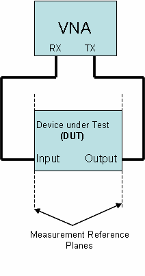

Fixture Calibration Setups
--------------------------

Only the cables, connectors, and adaptors connecting the TRANSMIT to
the calibration loads are part of the text fixture during the first
three fixture calibration steps. The fourth step also uses the cables,
connectors, and adaptors in the RECEIVE connection as well in order to
complete the fixture calibration. Typically all the cables,
connectors, and adaptors are left in place, and only the DUT is
removed during the Fixture Calibration steps.
 
Once all four steps are completed, click the "Save Cal Results..."
button. This will allow you to choose a file name and location. Be
sure to use a description filename, as you are likely to have many
different fixture calibration files.
 
Filenames are allowed to be long and may contain embedded spaces. The
software will automatically append a .cal suffix to your name.
Filenames are not limited to an 8.3 format, which would not be
sufficiently descriptive.

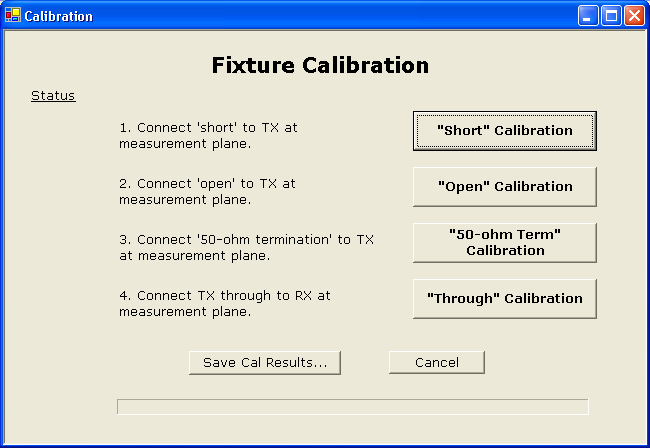

Short Fixture Calibration
-------------------------


Open Fixture Calibration
------------------------

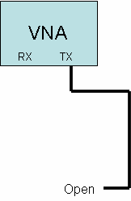

50-ohm Terminated Fixture Calibration
-------------------------------------

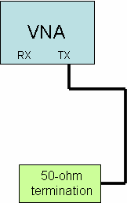

Through Fixture Calibration
---------------------------

The cables, connectors, and adaptors connecting both the TRANSMIT and
the RECEIVE connectors to the DUT are part of the test fixture.
Additionally, the bullet connector is part of the calibration test
fixture even though it will not be present in the actual measurement.
This represents a source of uncompensated error. Thus the connector
bullet must be short, low loss and impedance-matched to the cables in
order to minimize these errors.


VNA Software Menu
=================

The following menu items are available in the VNA program. Each menu
item is explained in the following sections.
 
File
 
View
 
Print
 
Print Setup Print Preview Set Plot title
 
Store Forward Parameters Store Reverse Parameters Export S-parameters
 
Rectangular Format Polar Format
 
Save Configuration ... Load Configuration ... Exit
 
Rectangular Polar
 
Time Domain Reflection
 
Calibration
 
Detector Calibration Run Fixture Calibration
 
Load Fixture Calibration File
 
Trace
 
S11 Magnitude (rectangular) S11 Phase (rectangular) S21 Magnitude
(rectangular) S21 Phase (rectangular)
 
S21 Group Delay (rectangular)
 
S11 Magnitude as SWR (rectangular)
 
Raw Calibration Data S21 -- Through (rectangular) Et -- Tracking Error
(Polar)
 
Es -- Source Mismatch Error (Polar) Ed -- Directivity Error (Polar)
 
Raw Calibration Data S11 -- Short (polar) Raw Calibration Data S11 --
Open (polar)
 
Raw Calibration Data S11 -- Terminated (polar)
 
Vertical Scale
 
10 dB / division 5 dB / division 2 dB / division [1 dB /
division]{.underline}
 
SWR 1.0 to 11.0
 
SWR 1.0 to 6.0
 
SWR 1.0 to 3.0 [SWR 1.0 to 2.0]{.underline}
 
10 microseconds / division 1 microsecond / division 100 nanoseconds /
division 10 nanoseconds / division 1 nanosecond / division [100
picoseconds / division]{.underline} Group Delay Aperture = 1 Group
Delay Aperture = 4 Group Delay Aperture = 16 [Group Delay Aperture =
64]{.underline} Right Scale display
 
Phase SWR
 
Delay Polar Zoom
 
Zoom = 1.0
 
Zoom = 1.5
 
Zoom = 2.0
 
Zoom = 2.5 TDR Setup
 
Marker
 
Change Marker Frequencies Clear All Markers
 
Marker Numbers
 
Enable Disable
 
Marker Parameters Enable Disable
 
FreqGrid
 
100 points
 
200 points
 
400 points
 
1020 points Storage
 
Store Recall
 
Display Storage
 
Help
 
Display Help About
 
Launch Browser (to check for Software Updates)

File Menu
---------

The File menu allows printing the measurements in graphical format,
and storing the S-parameters in a text file.
 
Print -- prints the selected view (rectangular or polar) to the
printer.
 
Print Preview -- provides a preview of what the printed page will look
like
 
Print Setup -- allows selecting the desired printer and setting the
print parameters Set Plot Title -- allows setting / clearing a textual
title for the plot that appears underneath the scope display
 
Store Forward Parameters -- store the measured reflection and
transmission data as S11 and S21 to temporary storage
 
Store Reverse Parameters -- store the measured reflection and
transmission data as S22 and S12 to temporary storage
 
Export S-Parameters -- exports the stored data in text format
Rectangular Format -- Real and Imaginary components of the S-
parameters normalized to 50 ohms
 
Polar Format -- Magnitude, in dB, and Phase in degrees of the S-
parameters normalized to 50 ohms
 
Save Configuration -- Saves the complete state of the instrument
settings and display traces to a file (except stored S-parameters).
The filename can be selected and should be very descriptive.
 
Load Configuration -- Loads a previously saved configuration file to
restore the state of the instrument from a previous measurement setup.
 
Exit -- immediately terminates the VNA application (and saves the
current instrument configuration to the file: [ ]{.underline}
last.cfg).

### Exporting S-Parameters

The VNA is a reflection-transmission test set. It can only measure
half of an S- parameter data set (S11 and S21 in the forward
direction) at one time. The DUT must be physically reversed in the
test setup in order to measure the other direction (S12 and S22 in the
reverse direction).
 
To measure and export a complete 4 parameter set:

-   First set the frequency sweep (start and stop frequencies), and
    apply calibration as desired.

-   Make a measurement sweep in the forward direction

-   Store Forward Parameters.

-   Next, physically reverse the DUT (exchange input and output).

-   Make a measurement sweep in the reverse direction without changing
    the frequency sweep or calibration-applied boxes.

-   Store Reverse Parameters

-   After these two datasets have been stored, you may Export the S-
    Parameters in either the Rectangular or Polar formats to a text
    file.

Both the forward and reverse storage arrays are locked once stored;
this prevents accidental over-write. The menu items appear with a
checkmark when
 
locked. The only way to unlock them is to Export the file. Both
forward and reverse arrays must be filled before the Export function
can work.

View Menu
---------

The View menu allows selecting the display view:

1)  Rectangular

2)  Polar

3)  Time Domain Reflection

The Rectangular display can display S11 magnitude and phase, and S21
magnitude, phase, and group delay. It can also show S21 ('Through')
calibration parameters. Magnitude is plotted as dB vs. frequency,
phase is plotted as degrees vs. frequency, and group delay is plotted
as time vs. frequency. The display units (dB/div, and seconds/div) can
be selected in the VertScale menu.
 
The Polar display can display S11 (reflection measurement) and the
calibration data associated with reflections measurements. The Polar
display does not show S21 measurements.
 
The Time Domain Reflection (TDR) mode performs a reflection
measurement then converts from a frequency measurement into the real
part of the time domain response. It displays the TDR response versus
time. It is useful for testing cables for faults. The TDR markers will
calculate the distance from the reference plane to the point indicated
by the marker. The TDR resolution is 4.1 nanoseconds. This limits the
resolution of the cable fault to about 1.3 feet (or about 0.4 meters).
The TDR mode ignores the Start and Stop frequencies, it needs to setup
a custom grid.

Calibration Menu
----------------

The Calibration menu provides three options:

1)  Generate (and save) a Detector calibration data set.

The detector calibration data set is auto-loaded by the application if
it exists. It does not normally need to run except the first time the
instrument is used. Only one detector calibration file is needed.

2)  Run (Generate, load, and save) a fixture calibration data set.

A separate fixture calibration set is needed for each different test
fixture.

3)  Load a previously saved test fixture calibration data set by name.

The Detector calibration procedure is described in section 3. The
Fixture calibration procedure is described in section 4.
 
**Appendix 2 -- Calibration Details** provides a more detailed
description of how the calibration routines work.

Trace Menu
----------

The Trace menu allows selecting which measurements are displayed. The
Polar display only displays reflection measurements (S11) and related
raw and derived calibration constants. The rectangular display can
show both S11 and S21 measurements, and the calibration constants
related to S21.

#### Device Under Test -- DUT

The reflection and forward measurements are made with respect to the
Device Under Test (DUT). The reference plane location is established
when the fixture calibration is run and loaded.

### Rectangular Display Mode

S21 can be displayed only on the rectangular display. S11 can be
displayed on both the rectangular and polar displays. The traces that
can be displayed on the Rectangular display are:
```
+-----------------------------------+-----------------------------------+
| > S11 Magnitude                   | The magnitude, in dB., of the     |
|                                   | input return loss of the          |
|                                   |                                   |
|                                   | Device Under Test (DUT).          |
+===================================+===================================+
| > S11 Phase                       | The phase angle, in degrees, of   |
|                                   | the input return loss of          |
|                                   |                                   |
|                                   | the DUT, from +180 to --180.      |
+-----------------------------------+-----------------------------------+
| > S21 Magnitude                   | The magnitude, in dB. of the      |
|                                   | forward transfer gain (or         |
|                                   |                                   |
|                                   | loss) of the DUT.                 |
+-----------------------------------+-----------------------------------+
| > S21 Phase                       | The phase, in degrees, of the     |
|                                   | forward transfer gain (or         |
|                                   |                                   |
|                                   | loss) of the DUT.                 |
+-----------------------------------+-----------------------------------+
| > S21 Group Delay                 | The derived group delay of the    |
|                                   | forward transfer gain (or         |
|                                   |                                   |
|                                   | loss) of the DUT.                 |
+-----------------------------------+-----------------------------------+
| > Raw Calibration Data            | Raw data taken from the through   |
| >                                 | connection of                     |
| > -- S21 'Through'                |                                   |
|                                   | > TRANSMIT to RECEIVE on the VNA  |
|                                   | > (through the actual cables used |
|                                   | > to connect to the DUT)          |
+-----------------------------------+-----------------------------------+
| > S11 Magnitude as                | The value of S11 magnitude        |
| >                                 | converted into SWR.               |
| > SWR                             |                                   |
+-----------------------------------+-----------------------------------+
```
### Polar Display Mode

S11 (as a polar complex number) is always displayed on the Polar
display. S21 cannot be displayed on the polar display. The raw
calibration data (from the
 
calibration file that is loaded) as well as the error parameters
derived from the calibration data can be displayed. Normally the error
compensation and raw error data are for informational purposes only
and are not displayed.
 
The traces that can be added to the Polar mode display are:
```
+-----------------------------------+-----------------------------------+
| > Et -- Tracking Error            | > A complex plot of the amplitude |
| > compensation                    | > and phase of the cables         |
|                                   | > connecting the TRANSMIT         |
|                                   | >                                 |
|                                   | > connector of the VNA to the DUT |
+===================================+===================================+
| > Es -- Source Mismatch Error     | > A complex plot of the error due |
| >                                 | > to imperfect                    |
| > compensation                    | >                                 |
|                                   | > source impedance termination.   |
+-----------------------------------+-----------------------------------+
| > Ed -- Directivity Error         | > A complex plot of the error due |
| >                                 | > to finite                       |
| > compensation                    | >                                 |
|                                   | > directivity in the directional  |
|                                   | > coupler circuitry.              |
+-----------------------------------+-----------------------------------+
| > Raw Calibration Data -- S11     | > Raw data taken from the shorted |
| >                                 | > load during                     |
| > 'Short'                         | >                                 |
|                                   | > calibration (or loaded from a   |
|                                   | > calibration file).              |
+-----------------------------------+-----------------------------------+
| > Raw Calibration Data -- S11     | > Raw data taken from the open    |
| >                                 | > load during                     |
| > 'Open'                          | >                                 |
|                                   | > calibration (or loaded from a   |
|                                   | > calibration file)               |
+-----------------------------------+-----------------------------------+
| > Raw Calibration Data -- S11     | > Raw data taken from the 50-ohm  |
| >                                 | > terminated                      |
| > 'Terminated'                    | >                                 |
|                                   | > load (or loaded from a          |
|                                   | > calibration file).              |
+-----------------------------------+-----------------------------------+
```
### Time Domain Reflection Mode

The TDR mode displays the real part of the Inverse Fast Fourier
Transform of a reflection measurement. Because the TDR mode requires a
specific custom frequency grid, it ignores the Start and Stop
settings. When switching to the TDR mode, a new Frequency Grid is
created. Thus, a new sweep is required. Click the sweep button. A [TDR
interpretation of existing S11 sweep data is not]{.underline}
[meaningful]{.underline} and should be ignored, instead re-acquire the
reflection measurement after you have selected the TDR mode. The
'Apply Calibration' checkbox sets the reference plane for the TDR
analysis. When the 'Apply Calibration' box is checked, distances
specified on the TDR display are with respect to the reference plane
(the end of the cable calibrated with the Short, Open, and Termination
loads).
 
The display Start time, display Stop time, and estimated velocity
factor of a cable under test are specified in the TDR Setup dialog,
reached from the Vertical Display menu. Additionally, distances from
the Reference Plane to the Marker point can be displayed in METERS or
FEET.
 
The resolution of the TDR mode is 4.167 nanoseconds, it is limited by
the maximum frequency that can be generated by the VNA instrument (120
MHz). It is possible to infer between TDR points by visually
interpolating. For example, if two consecutive TDR points have the
same large time reflection, the actual time position will lie in
between those two consecutive times.

Vertical Scale Menu
-------------------

The Vertical Scale menu allows independently selecting the vertical
scale units per division for magnitude (in dB / division), the maximum
SWR display (minimum is always 1.0), the group delay (seconds per
division), and the aperture size of the group delay computation.
 
For more information see **Appendix 4 -- Group Delay and Aperture**
for more details on how group delay is derived and how the data can be
smoothed (or distorted) by changing the aperture size.
 
Note that for small frequency spans, the noise of the group delay
measurements is magnified significantly due to the small difference
frequency between adjacent samples. For best results, use the largest
aperture window, and the largest number of gridpoints in order to
reduce the measurement noise for narrow sweeps. However, large
apertures may smooth the data beyond the range of interest, so care
must be used to select an appropriate aperture size.
 
Magnitude. The display resolutions selectable are: 10 dB / division
 
5 dB / division 2 dB / division 1 dB / division
 
SWR. The display resolutions selectable are: SWR 1.0 to 11.0
 
SWR 1.0 to 6.0
 
SWR 1.0 to 3.0
 
SWR 1.0 to 2.0
 
Group Delay. The display resolutions selectable are: 100 microseconds
/ division
 
10 microseconds / division 1 microsecond / division 100 nanoseconds /
division 10 nanoseconds / division 1 nanosecond / division 100
picoseconds / division
 
Group Delay Aperture. This sets the number of adjacent frequency bins
over which group delay is measured.
 
Group Delay Aperture = 1 Group Delay Aperture = 4 Group Delay Aperture
= 16 Group Delay Aperture = 64
 
Right Scale Display. This selects the scale printed on the rights side
of the rectangular display. The display values automatically adjust to
the selected vertical scale factors.
 
Phase SWR
 
Delay
 
Polar Zoom Factor. This selects a zoom factor to be applied to the
polar display. The default value is 1.0, and represents a normal polar
(Smith Chart) type of display, with a reflection coefficient of 1.0
lying on the periphery of the chart. Increasing the zoom magnifies the
display keeping the 50 + j0 point (the center of the chart) in the
center. Magnifying the display thus allows viewing impedances near 50
+ j0 with more resolution. A zoom factor of 2.0 places a reflection
coefficient value of 0.5 on the periphery of the chart. There are four
display zoom settings.
 
Zoom = 1.0
 
Zoom = 1.5
 
Zoom = 2.0
 
Zoom = 2.5
 
TDR Setup. The allows setting the Start Time (in nanoseconds) and the
Stop Time (in nanoseconds) for the TDR display. This allows you to
zoom into the area of interest. It also allows entering an estimated
value of the cable velocity factor, which is used to calculate the
distance from the reference plane to the marker point (perhaps a cable
fault). The valid range of velocity factors is 0.4 to 0.99. It also
allows selecting whether the distance display should be in Meters or
Feet.

Marker Menu
-----------

The Marker menu allows setting up to five marker frequencies, and
enabling or disabling the display of marker numbers and their
parametric values.
 
Markers can also be set by *left-clicking* on the display at a
frequency of interest. The first unused marker will be loaded with the
frequency corresponding to the position of the mouse. If the mouse is
moved before releasing the left button, the marker is *dragged* across
the screen. If the left button is clicked and held on an existing
marker, that marker can be dragged instead of dropping a new marker
(but you have to very accurate in pointing the mouse -- especially at
high display resolutions). If all markers are in use, then the
left-click will not create a new one but can drag an exiting one. The
screen parameters update in real-time as the marker is dragged.
 
A value of 0 effectively disables the display of a marker (since 0
will always be off the left side of the display screen). Any marker
with a value of 0 is considered unused. It can be used by entering a
displayable value in the marker entry menu.
 
Additionally, the first unused marker will be assigned anytime the
mouse is left- clicked.
 
The frequency of interest is readily apparent on the rectangular
display, but not so on the polar display. You will however be able to
see the marker move as you drag the mouse left and right. If marker
parameters are enabled, you will be able to see a reading indicating
the marker frequency while in the polar display mode. The marker may
appear to move backwards compared to the mouse movement if the polar
display is showing S11 in the lower (capacitive) half of the display.
 
Vertical (up/down) movement of the mouse does not change the marker
frequency.
 
The Marker parameters are color-coded to match the color of the
corresponding trace on the display.
 
The parametric values S11, S21, and SWR are displayed only if the
associated trace display is enabled.
 
Change Marker Frequency -- Allows setting any of the five marker
frequencies. A marker set to a frequency that is smaller than
startFrequency or larger than stopFrequency will not display. Thus,
setting a marker to zero will disable its display.
 
Clear All Markers -- Sets all markers to zero, thus disabling their
display. Marker Numbers
 
Enable -- displays the marker number above each marker. Disable --
turns off the marker number, showing just the markers.
 
Marker Parameters
 
Enable -- displays the marker parametric value(s) underneath marker
frequency.
 
Disable -- turns off the marker parametric display.

Frequency Grid Menu
-------------------

The FreqGrid menu allows selecting the number of points in the
Frequency Grid. This is the number of measurements made from Start
Frequency to Stop Frequency and displayed on the display. The values
allowed are:
```
+---------------+-------------------------------------------+
| > 100 Points  | > Coarsest frequency display, but fastest |
|               | >                                         |
|               | > acquisition of measurement data.        |
+===============+===========================================+
| > 200 Points  |                                           |
+---------------+-------------------------------------------+
| > 400 Points  |                                           |
+---------------+-------------------------------------------+
| > 1020 Points | > Finest frequency display, but slowest   |
|               | >                                         |
|               | > acquisition of measurement data.        |
+---------------+-------------------------------------------+
```
The instrument defaults to 200 points at startup. More points allows
greater resolution in the display, fewer points shortens the
measurement time period. The current setting of the number of points
also affects the exportation of an S- parameter text file, which will
have the same number of individual frequency records as the number of
points in the grid. The calibration runs are fixed in size at 1024
frequency points. When the 'Apply Calibration' box is checked, each
point in the current frequency grid is interpolated to the nearest
calibration frequency point, and the calibration results from that
nearest point is applied to the measurement. Calibration points are
about 117 KHz apart, so the nearest one is no farther than 59 KHz
away. Unless the fixture has resonances (which is very bad anyway) the
error due to interpolation for any size of frequency grid will be
negligible except for very long cables.

Storage Menu
------------

The Storage menu allows storing the current measurement set into
temporary memory. This temporary memory will retain that measurement
set until the program is terminated, or a new measurement set is
stored. A new stored measurement set over-writes the existing
measurements in storage.
 
There are three options in the Storage menu: Store
 
Recall
 
Display Storage
 
'Store' captures the complete raw measurement set (whether or not the
traces are displayed) and stores it to memory.
 
'Recall' retrieves the measurement set from memory and over-writes the
current active measurement set. It does not delete or alter the raw
data in storage.
 
'Display Storage' is a toggle that is checked when the contents of
storage are being displayed.
 
A Common use of the storage function is to make a measurement, verify
it's useful, then 'store' the data. Next, some change to the device
under test is made and a new measurement is made. Enabling the Display
Storage option allows comparing on-screen the two measurements.
 
The markers are only attached to the active display set, MARKERS ARE
NOT ATTACHED TO THE STORED DATA. This helps to distinguish which data
on screen are active and which are storage. If you need to use markers
on the stored data, that data should be retrieved to the active set
using the 'recall' menu item.

Integration Menu
----------------

The Integration menu allows multiple sweeps of the instrument to be
averaged together. The value of 1x mean no integration. The value of
2x means that the readings will average the previous sweep with the
current sweep. Values of 4x, 8x, and 16x uise exponential integration
to average the results. This means for example, that at 16x, the scope
display will be equal to 15/16 of the old display value plus 1/16 of
the new value. When the Integration selection is changed, the
integrator is RESET. This means that the next sweep will display the
raw values from a single sweep. Subsequent sweeps will integrate.
Changing the Frequency Grid size will also reset the integrator.
 
Resetting the integrator prevents a large offset from taking a long
time to clear out of the integrated value, and can be useful when
making changes to the unit under test and it is not desired to wait to
see the initial results.

Help & Software Updates
-----------------------

The help menu launches the HTML Help viewer with the VNA help menu.
 
The About command opens an 'about VNA' menu. This menu displays the
current build number of the software
 
It also contains a button to launch your Internet Browser with the
address of the TAPR VNA software update website. This will display a
page showing the current software available for the VNA. You can
compare your build number with the latest build available number shown
on the web page. Be sure to REFRESH your web browser display. If you
wish, you may download the update from this page (right-click, and
Save as ...)
 
To install the update, you will need to exit the VNA application
first.

Controls
========

There are several controls on the VNA instrument screen. These change
the start and stop frequencies, the reference and transmit signal
levels, and control the sweep functions. These controls are not shown
on the printed outputs.

Frequency Controls
------------------

The frequency controls set the START and STOP frequencies of a sweep.
The arrows increment or decrement the frequencies. The control can be
set to a specific value by double-clicking the control, which will open a
numeric entry dialog box allowing the desired frequency to be typed
directly.
 
Both START and STOP controls display an underscore character
underneath one of the digits. This digit is the one that will be
incremented or decremented by the up or down arrows. The left and
right arrow allow changing which digit position is selected. The
controls will not increment above 120,000,000 Hz, nor below 200,000
Hz.
 
The STOP frequency must be greater than the START frequency by the
size of the frequency grid. If the grid size is 400 points, for
example, STOP must be at least 400 Hertz greater than START.

Level Controls
--------------

The Reference Level control adjusts how the magnitude data are
displayed on the display screen. The value in the control specifies
the magnitude level of the top line of the display screen. When it is
set to 0 dB, the top line of the display is 0 dB. Changing the
Reference Level allows you to optimize the trace location.
 
For example, if the DUT has an attenuation of approximately 22 dB,
then it could not be displayed at a scale of 1 dB / division, because
it would be off the bottom of the screen. Setting the Reference Level
control to -20 dB would allow the screen to show the range of -20 db
to -30 db at 1 db/division, making the trace visible.
 
The Reference Level control can also be set to positive values. This
is useful when measuring DUT's (such as amplifiers) with output
magnitudes near or above 0 dB. Note that the dynamic range of the VNA
only extends a few dB above 0 dB. [An external attenuator should be
used if the DUT has any amount of]{.underline} [gain.]{.underline}
 
The on-screen amplitude display values on the left-side of the display
screen automatically adjust when you change the value of the reference
level. It is sometimes useful to set the reference level to a small
positive number when measuring a low-loss DUT to make sure the markers
and marker numbers display properly.
 
The Transmit Level control should normally be left at 0 dBm.
Decreasing the value of the control will usually degrade the dynamic
range and accuracy of both the S11 and S21 measurements. However, it
can be useful to reduce the drive level to a DUT that has gain. The
control has about 50 dB of adjustment range, but the VNA dynamic range
consumes 40 dB of that range. Thus, the S21 magnitude measurements can
only effectively support less than 10 dB of level change. A much
better approach is to attenuate the Transmit signal to the DUT with an
attenuator. Additionally, the S11 measurements will be seriously
degraded with any reduction of the Transmit level.
 
The magnitude values on the display automatically track changes in the
Transmit Level. By the way, one valid use for the Transmit Level
control is to adjust the output level when the VNA is being used as a
signal generator and the measured values are of no concern. In this
case, the Transmit level can be used to change the transmit output
signal level over a 10 dB range.

Apply Calibration
-----------------

The apply calibration check box is grayed-out unless a fixture
calibration data set has been loaded (see calibration menu). Checking
the Apply Calibration box will compensate all readings by the
corrections contained in the loaded fixture calibration set.
Un-checking the box disables the reading corrections.
 
Measurements without any fixture calibration are not accurate, since
there are uncompensated errors in cable length, fixture attenuation,
etc. Further, some VNA instrument errors such as PC board trace
lengths and amplitude variations are not removed if the measurement is
uncalibrated. For best accuracy, measurements should have fixture
calibration applied.

Sweep Controls
--------------

There are three buttons on the screen that control how the VNA
acquires data. These three buttons are:

-   Sweep Speed

-   Single Sweep

-   Free-run Sweep

The Sweep Speed button determines the sweep dwell time for each
measured sample, and if the VNA data are checked for measurement
glitches. If set to the Fast mode, the VNA sweeps as fast a possible,
and does not check the reading data for measurement glitches. As the
button is successively clicked, the sweep speed will be set to the
following values:

-   30 microseconds

-   100 microseconds

-   300 microseconds

-   1 millisecond

-   3 milliseconds

-   10 milliseconds

The button recycles back to Fast after the 10 ms step. When the button
displays any time value (but not Fast), more extensive comparison of
the measured data is used to try and reject obviously defective
individual data points (not always successfully). In the Fast mode
these checks are bypassed, sometimes resulting in momentary glitches
in the measured data. However, the Fast mode sweeps much than any of
the timed modes.
 
The single sweep mode triggers the VNA one time, and holds the
measured data after that single sweep.
 
The Free-run sweep button causes the VNA to trigger continuously
(recurrently), so that the sweep updates as rapidly as possible.
Pressing the Free-run sweep button a second time stops the recurrent
sweeping. The frequency grid button is grayed-out when the VNA is
sweeping, since the number of points cannot be changed during a sweep.
 
One very useful setup is to use a small frequency grid, for example
100 or 200 points, fast sweep mode, and recurrent sweep. This allows
the display to update rapidly, and may be particularly useful when
tuning a DUT such as a filter or antenna in real-time.

Mouse Actions
-------------

The mouse left and right buttons can be used to perform several
different actions on the screen display.
 
The **Left mouse button** can be clicked while in the rectangular
display mode to drop a marker at the frequency where the mouse points
horizontally. If the left button is held down, the marker can be
dragged left and right. The marker freezes when the left button is
released. An existing marker can be grabbed with the left mouse and
dragged, but it takes very precise aim, and is pretty difficult to do
in practice. It's usually easier to bring up the Marker menu, disable
that particular marker (by entering a value of zero) and then droping
and draging a new marker with the mouse. Alternatively, the cursor can
be set coarsely with the mouse, and then the Marker Menu used to set
the frequency precisely.
 
The **Right mouse button** provides a reading of the screen
coordinates exactly where the mouse is pointing (whether or not there
are any traces near the mouse). This works in both rectangular and
polar modes. The popup window will stay in place until the mouse is
moved a few pixels at which point it will disappear.

Example Measurement
===================

To make a measurement of a device under test, the following general
steps are used.

1.  Make sure that the detector calibration has been run (you do not get
    the warning message on program startup).

2.  Connect the cables and adaptor to be used to connect to the device
    under test (DUT) to the VNA.

3.  Either run a Fixture calibration on these cables and adaptors, or
    load a previously saved fixture calibration for these exact same
    cables and adaptors.

4.  Remove any shorts, or through connector barrels, and replace with
    the DUT connected from RECEIVE to TRANSMIT.

5.  Run a sweep of the DUT.

6.  Enable the Fixture Calibration checkbox on screen. This checkbox can
    be selected or deselected at any time (before or after the sweep).

Let's look at an example DUT, a low pass filter. A single sweep of
data captures all the data points shown in the following three screen
shots. The different screen shots are just different views of the
single data set.

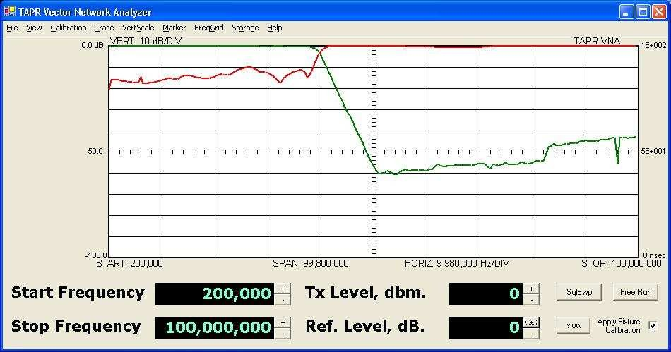

This screen shows GREEN -- the S21 transfer magnitude (forward
gain/loss). The screen in set for 10 dB / division. RED is the S11
return loss of the filter, again at 10 dB / division. The filter has
about 60 dB loss at 50 MHz, degrading a bit at 100 MHz. The return
loss of the filter is about 10-15 dB in the filter passband (200 KHZ
to 40 MHZ) and is 0 dB in the stopband (above 40 MHz).
 
This type of filter is called a *"reflective filter"* since it
generates a stopband by reflecting the input signal back.
 
On the next screen, the S11 (RED) trace has been turned off and only
the S21 (GREEN) trace is displayed. Five markers have been set, and
the display of marker parameters has been enabled. Here we can see
that the insertion loss of the filter is quite good, only about 0.1 dB
in the passband, and that the -3 dB frequency is about 39.85 MHz.
 
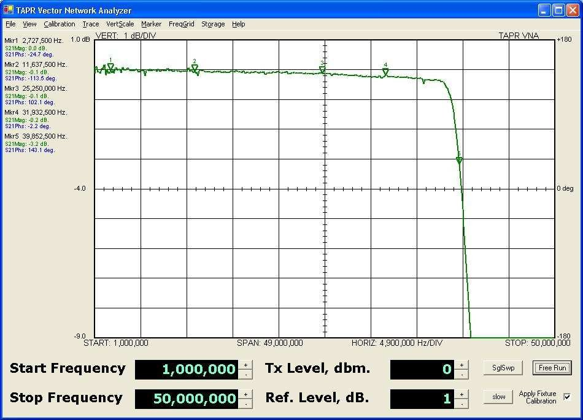
 
The last figure shows the input return loss (S11) on a polar chart.
Four markers (which must be set in the rectangular display mode) are
selected, and marker parameter display is again enabled. The markers
show the input magnitude and phase as well as the equivalent input
impedance of the filter at each marker frequency. The filter spirals
outwards from the origin, but stays between the SWR=1.5 and SWR=2.0
concentric bull's eyes until it reaches the stopband frequency, when
it rapidly spirals out of the center toward the periphery of the
chart. The light gray concentric SWR circles on the polar chart are:

-   SWR = 1.5 (Innermost)

-   SWR = 2.0

-   SWR = 3.0

-   SWR = 5.0

-   SWR = 10.0 (Outermost)

Due to small ripple errors in the directional coupler, the stopband
return loss is calculated as negative a few tenths of a dB (which is
wrong). This is shown at marker 4. The polar chart is very non-linear
and changes in return loss of tenth's of a dB cause the distance from
the center of the chart to change a lot when the return loss is near
zero dB, but these changes are minimal when the return loss is more
than a few dB.
 
The VNA software currently compensates for frequency dependent errors.
Starting with version 1.4 the software models the coupler V/I tracking
error and coupler directivity. It compensates readings by subtracting
the coupler directivity and applying a sinusoidal magnitude correction
vs. detected phase angle to S11 readings.

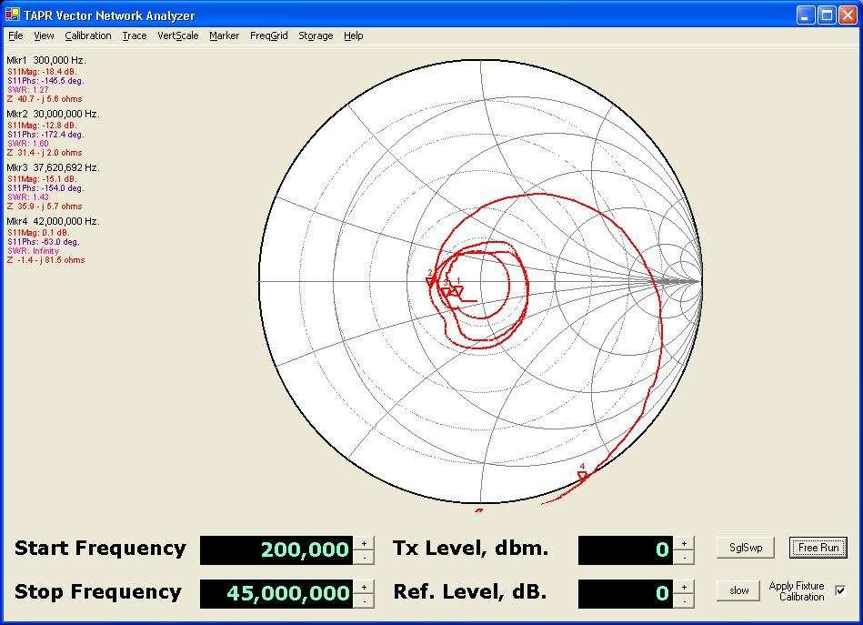

By the way, these plots are of a high-quality Bencher YA-1
low-pass-filter designed for amateur radio HF work.

Some Cautions
-------------

-   High quality variable attenuators may have several tenths of a dB
    loss when set to the zero dB setting. This must be taken into
    account when characterizing filter insertion loss.

-   The resistance of an attenuator may not be exactly 50.0 ohms. This
    will degrade the 50-ohm calibration.

-   An attenuator has finite length. Thus if an attenuator is inserted
    (or removed) after fixture calibration, the phase angles of the
    setup will differ

from the Fixture correction because the distance to the 'SHORT' and
'OPEN' used for fixture calibration has changed.

-   The input impedance of the VNA RECEIVE connector is only
    approximately 50 ohms. When measuring the return loss of a network
    that has minimal attenuation, the phase and amplitude components may
    experience errors due to this deviation of the RECEIVE connector
    from an ideal 50 ohm load. To improve the measurement either:

    -   Terminate the unit under test with a 50 ohm termination prior to
        taking S11 measurements, or

    -   Insert a 10 dB attenuator between the output of the unit under
        test and the VNA RECEIVE connector. This will assure that the
        device under test sees an more accurate 50 ohm termination
        impedance.

Common Display Results
----------------------

Some common measurements will result in the displays shown in this
section. These can be used to verify that you have correctly
calibrated and setup the VNA and the test cables. These results are
typical, but you may realize slight differences depending on the
cables, instrument measurement errors, etc.
 
Also, there may be minor variations between consecutive instrument
sweeps due to measurement variation or other artifacts. These sweeps
were performed in the 'Slow' mode.

-   Shorted cable -- with and without cable calibration. The following
    charts show the polar and rectangular displays of a shorted cable on
    the TRANSMIT connector. The fixture calibration was performed with
    the same cable and short as the measurement, so the fixture and
    amplitude compensation should match (excepting sweep-by-sweep
    measurement errors, instrument temperature change, etc.).

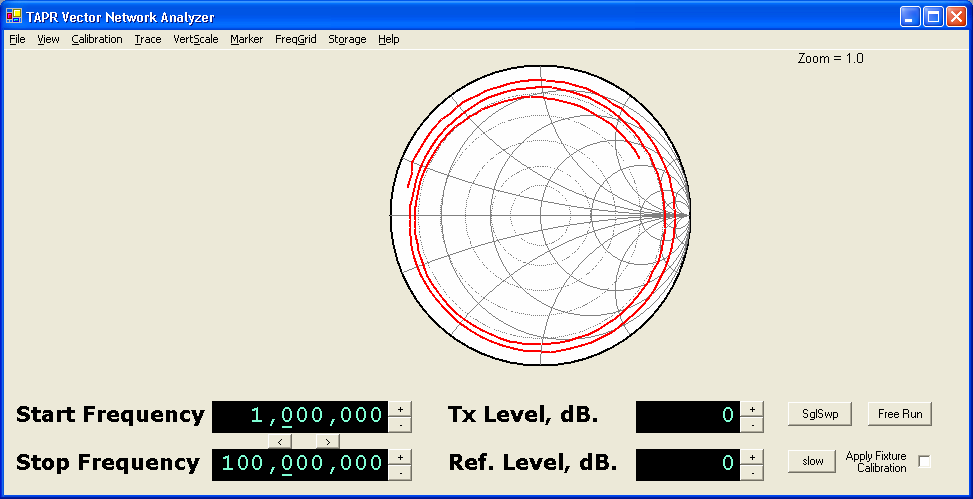

*3 meter cable terminated in 'Short' [without]{.underline} fixture
calibration applied.*

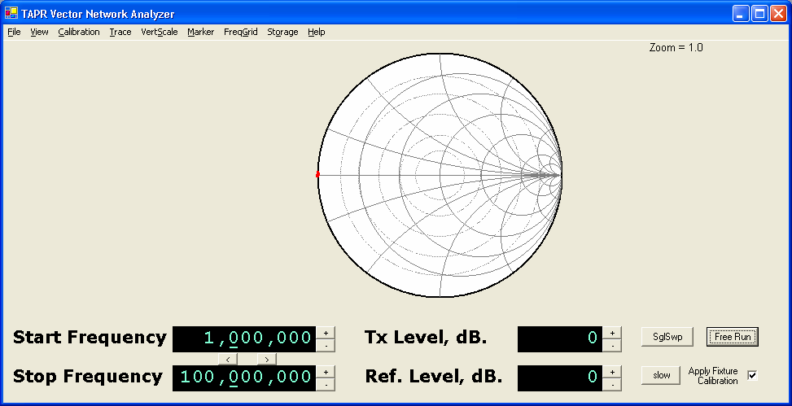

*3 meter cable terminated in 'Short' [with]{.underline} fixture
calibration applied.*

-   Open cable -- with and without cable calibration. The following
    charts show the polar and rectangular displays of an open cable on
    the TRANSMIT connector. The fixture calibration was performed with
    the same cable as the measurement, so the fixture and amplitude
    compensation should match (excepting sweep-by-sweep measurement
    errors, instrument temperature change, etc.).

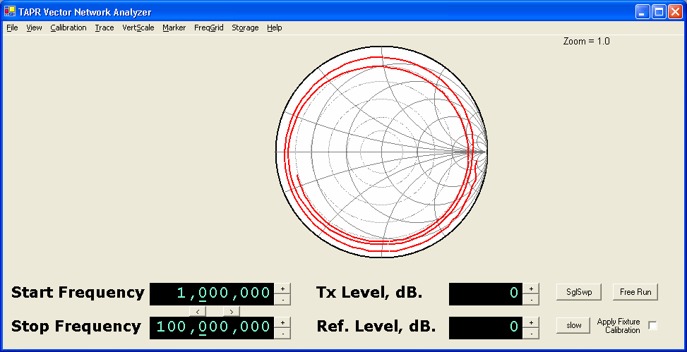

*3 meter cable terminated in ''Open' [without]{.underline} fixture
calibration applied.*

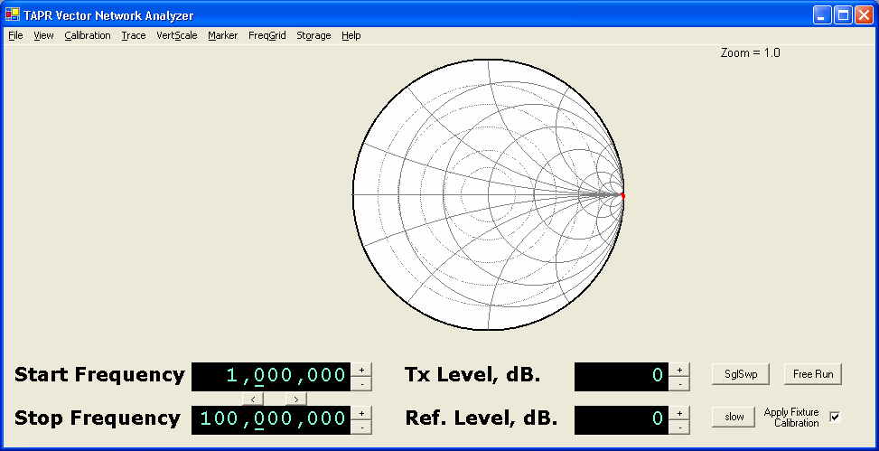

*3 meter cable terminated in ''Open' [with]{.underline} fixture
calibration applied.*

-   Terminated cable -- with and without cable calibration. The
    following charts show the polar and rectangular displays of a
    reasonable quality 1 meter 50-ohm cable terminated with a 50-ohm
    load on the TRANSMIT connector. The fixture calibration was
    performed with the same cable and termination as the measurement, so
    the fixture and amplitude compensation should match (excepting
    sweep-by-sweep measurement errors, instrument temperature change,
    etc.). [Note]{.underline}: many cables connected to the VNA (through
    a multitude of adaptors) may exhibit much poorer return loss than
    the example shown here.

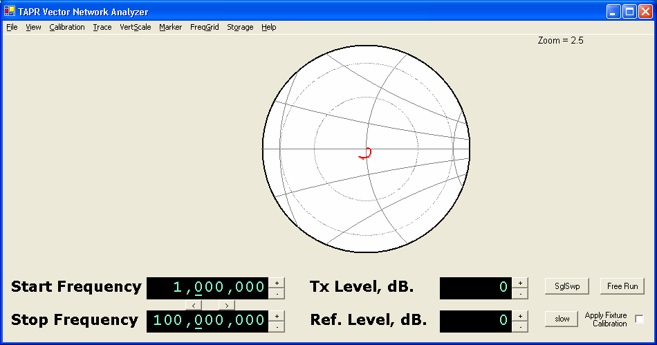

*1 meter cable terminated in 50-ohm load [without]{.underline} fixture
calibration applied. The polar scale has been zoomed to 2.5:1 to show
more details.*
 

 
*1 meter cable terminated in 50-ohm load [with]{.underline} fixture
calibration applied. The polar scale has been zoomed to 2.5:1 to show
more details.*

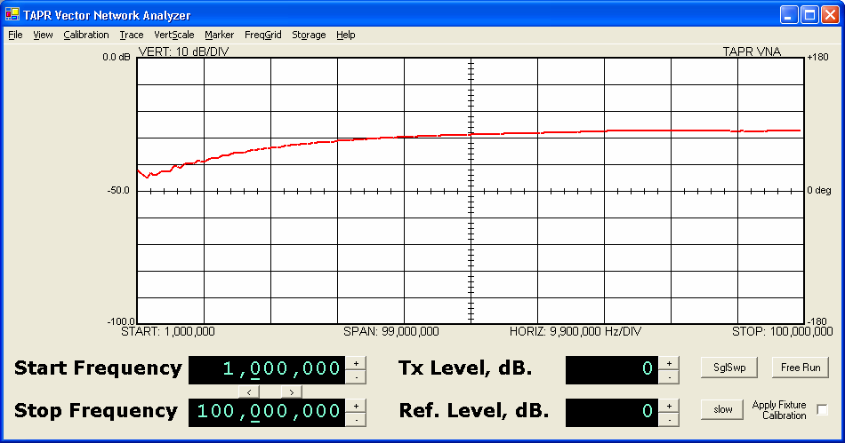

*1 meter cable terminated in 50-ohm load [without]{.underline} fixture
calibration applied.*
 
*Rectangular display of S11.*
 
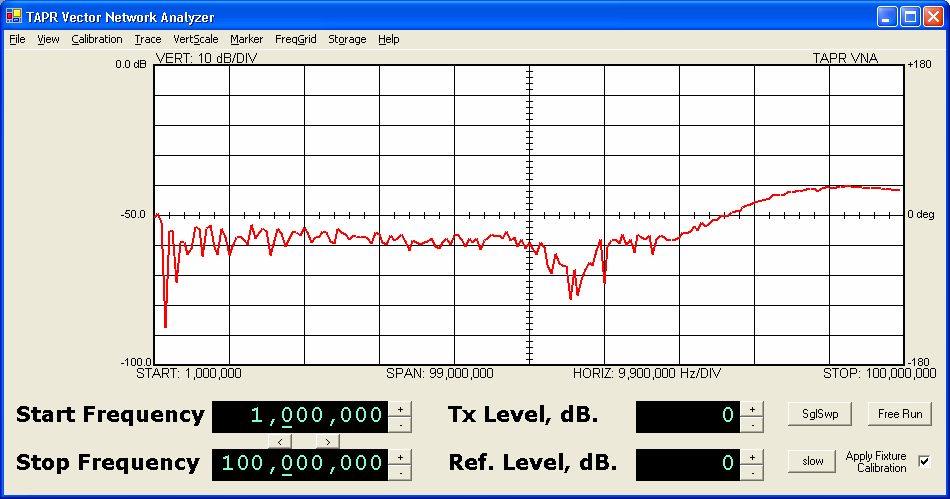
 
*1 meter cable terminated in 50-ohm load [with]{.underline} fixture
calibration applied.*
 
*Rectangular display of S11.*

Appendix 1 -- Overview of S Parameters
======================================

This overview briefly covers the basics of reflection and transmission
measurements using S-parameters, and the visualization of them on a
rectangular and polar display.
 
A linear two port device can be characterized by the behavior of the
voltage returned to voltage injected at the ports. The S-parameter
model provides all the linear characteristics of a two port device at
discrete spot frequencies. The S- parameters describe the input return
loss, forward gain, reverse gain, and output return loss each as a
complex number at a single frequency. For each discrete frequency,
these 4 values describe the behavior of the two port device. To
characterize a device, the S-parameters are usually measured at a
number of different frequencies.
 
In the diagram below, a1 in the voltage input to port one, and a2 is
the voltage input to port two; b1 is the voltage out of port one,
while b2 is the voltage out of port two. The S-parameters are defined
as the ratio of voltages. S11 (the input return loss) is the ratio
b1/a1. S21 (the transfer gain) is the ratio of b2/a1. The voltage
exiting port one of the block is the sum of the input return loss time
the input voltage plus the reverse gain times the voltage injected
into port two of the block. The S-parameters are defined in the
following two equations:

#### b1 = a1 \* S11 + a2 \* S12 b2 = a1 \* S21 + a2 \* S22


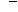
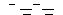

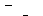
 
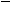
The VNA is really a
transmission-reflection test set. It can launch a voltage into port
one of the device (a1), and measure the voltage received by ports one
(b1) and two (b2). Thus, it is capable of deriving the value of S11
(because a2 is zero

-   nothing is launched into port 2 of the block), and the value of S21
    (similarly because a2 is zero). In order to derive the values of S12
    and S22, the network has to be reversed in the test fixture so that
    ports one and two swap positions.

In general, both S11 and S21 are complex numbers -- in other words, at
any spot frequency the network reflects voltage back to the input, but
the magnitude and the phase of the reflection are both non-zero.
Similarly, the network amplifies the input power (a1), and alters both
the magnitude and phase the resultant signal (b2). Thus the VNA
measures and displays the input reflection loss and the forward
transmission gain as complex numbers.

Polar Display
-------------

Since the reflection ratio (S11) is always less than or equal to unity
for passive networks, the value can be displayed in magnitude/phase
format on a polar chart. In general, we expect the forward gain to be
composed of both gain and loss values, so it may exceed unity. This
makes displaying it on a polar chart difficult, since the outside
circle of the polar chart constitutes a magnitude value of unity. Note
that the polar chart does not have any concept of frequency. All
different spot frequencies are displayed on the polar chart. The
software connects the dots in order to show a line. But it's not
always easy to determine what position on the line is at which
frequency. The polar chart makes it easy to see what the real and
reactive components of the input impedance are at any point. Thus, the
polar chart makes the visualization of the important characteristics
of S11 very easy.
 
The polar value of S11 is plotted directly on the polar chart, with
the S11 vector beginning at the center of the chart, the length of the
vector being the magnitude of the return loss, and the direction of
the vector being the phase angle of S11.
 
The left side of the chart corresponds to a direction of +180 or -180
degrees, and is the low-impedance area of the chart. The right side of
the chart corresponds to a direction of 0 degrees, and is the
high-impedance area of the chart.

Rectangular Display
-------------------

It is also possible to display the S11 and S21 values on a rectangular
display. In this case, the magnitude of the return loss is displayed
vs. frequency. This makes it easy to read how large the return loss is
at any given frequency, but it's difficult to understand how reactive
or resistive the input impedance really is. In contrast, we don't
usually care too much about the transfer impedance of a network, but
we do care about its gain vs. frequency, and its phase delay vs.
frequency. The rectangular chart makes the visualization of the
important characteristics of S21 very easy.
 
The magnitude of the return loss of the transfer gain/loss of the
network is expressed in dB on the right side of the rectangular chart.
The phase of the return loss or the phase of the transfer gain is
plotted as degrees vs. frequency. The top line of the rectangular
chart is +180 degrees, while the bottom line is - 180 degrees. The
rectangular chart 'wraps around' from the bottom to the top because a
phase angle of -180 degrees is the exactly the same as a phase angle
of +180 degrees. Thus the top line and the bottom line of the
rectangular chart represent precisely the same phase value.
 
This causes a confusing display when the phase value is 180 degrees,
but varies a few tenths of a degree above and below the value 180.0.
It would normally be a straight line, but the rectangular display will
show it as a trace that varies wildly up and down the screen, first
close to the top line, then alternatively at the bottom line, and then
back again at the top line.

Group Delay
-----------

Sometimes it's desirable to know the time delay properties of a
network. The group delay of a network is the negative of rate of
change of phase with respect to frequency. Group delay is sometimes
useful in determining the electrical length of a network such as a
cable or stub. The electrical length of a cable usually differs from
the physical length due to the velocity factor of the cable.
 
Thus, the group delay computation, along with a physical measurement
of the cable length allows computing the velocity factor of a cable.
 
The phase velocity of a cable is simply the time delay of the speed of
light traveling the length of the cable divided by the actual time
delay of the cable. Suppose a 10 foot piece of cable has a measured
delay of 15 nanoseconds. The speed of light is 11.8 inches per
nanosecond (very close to 1 nanosecond per
 
foot). Ten feet of free space would have a light speed delay of
120/11.8 = 10.17 nanoseconds. Thus the velocity factor of this cable
would be:
 
[10.17 nanoseconds (free space delay)]{.underline} 15 nanoseconds
(measured delay)
 
or a value of 0.68.

SWR
---

The SWR of a network at any specific frequency is a description of how
well the network input looks like a 50 ohm non-reactive load when the
output of that network is terminated in 50 ohms. An SWR of 1.0 means
that the network has exactly a 50-ohm input impedance. SWR is directly
related to the magnitude of the input return loss. SWR ignores the
phase angle portion of the input reflection, so it is a real number
whereas S11 is a complex number (containing both the magnitude and
phase angle of the input return loss.
 
An SWR of 2.0 means that the input impedance is either 25 ohms
resistive, 100 ohms resistive, or some complex value ranging between
those two impedances, and containing non-zero reactance. The value of
SWR does not tell us which of these cases the network looks like,
whereas S11 does.
 
On the polar chart, each constant value of SWR describes any impedance
lying on a circle centered on the center of the polar chart. The
center of the polar chart is 50+j0 ohms, an SWR of 1.0 (the circle is
a point). Higher values of SWR produce circles of increasing radius
centered on the chart center point. An SWR value of infinite is a
circle lying at the outside periphery of the polar chart.
 
The following table relates the SWR to the magnitude of the input
return loss.
```
+-----------+--------------------+
| > **SWR** | > **Return Loss,** |
|           | >                  |
|           | > **dB.**          |
+===========+====================+
| > 1.00    | > infinite         |
+-----------+--------------------+
| > 1.03    | > 36.60            |
+-----------+--------------------+
| > 1.05    | > 32.25            |
+-----------+--------------------+
| > 1.10    | > 26.45            |
+-----------+--------------------+
| > 1.15    | > 23.12            |
+-----------+--------------------+
| > 1.20    | > 20.83            |
+-----------+--------------------+
| > 1.30    | > 17.70            |
+-----------+--------------------+
| > 1.40    | > 15.56            |
+-----------+--------------------+
| > 1.50    | > 13.98            |
+-----------+--------------------+
| > 1.60    | > 12.74            |
+-----------+--------------------+
| > 1.70    | > 11.73            |
+-----------+--------------------+
| > 1.80    | > 10.88            |
+-----------+--------------------+
| > 1.90    | > 10.16            |
+-----------+--------------------+

+------------+--------+
| > 2.00     | > 9.54 |
+============+========+
| > 2.50     | > 7.36 |
+------------+--------+
| > 3.0      | > 6.02 |
+------------+--------+
| > 4.0      | > 4.44 |
+------------+--------+
| > 5.0      | > 3.52 |
+------------+--------+
| > 10.0     | > 1.74 |
+------------+--------+
| > 20.0     | > 0.87 |
+------------+--------+
| > infinite | > 0.00 |
+------------+--------+
```
Appendix 2 -- Calibration Details
=================================

Detector Calibration
--------------------

The detector calibration routine applies a range of signals from
approximately 0 dBm down to -90 dBm to each magnitude detector
(transmission and reflection). It does this repeatedly over the range
200 KHz to 120 MHz. The calibration software models each detector
response function (voltage vs. level) at each frequency. The model
consists of a linear portion and noise floor portion. The software
models the linear portion by generating a linear least-squares
regression estimator for amplitude measurements, and a correlation
coefficient. Then it generates an empirical exponential estimator for
the noise floor that allows a smooth curve to be fit to the complete
linear + noise floor response.
 
The detector calibration routine similarly characterizes both phase
detectors. The phase calibration process is a bit more complex than
the amplitude calibration process. It uses a fixed length of cable and
a varying frequency to develop a linear frequency-dependent phase
excitation to the detectors. Then it finds the proper voltage levels
that are output by the phase detectors corresponding to - 180, 0, and
+180 degrees (the positive peak, midpoint, and negative peak voltages
respectively). The phase detectors have a periodic error component,
and the detector calibration routine uses a linear delay model to
build a table to correct those periodic errors.
 
All the various data sets are then saved in the file
['detector.ica']{.underline} in the VNA program startup directory.
 
**Fixture Calibration S21 Compensation**
 
The Fixture calibration routine measures the received signal through a
small bullet or barrel connector. It measures the received magnitude
and phase at 1024 points across the range 200 KHz to 120 MHZ and
stores all the data in a table in the Fixture calibration file (which
you name during the Fixture calibration save operation). The
calibration compensation routine divides the S21 actual measurement by
the nearest 'Through' calibration constant (which is a complex number)
at each different measurement frequency when the 'Apply Calibration'
box is enabled.

S11 Compensation
----------------

The calibration compensation for S11 derives three parameters of a
virtual S- parameter error matrix computationally inserted between the
VNA TRANSMIT connector and the DUT. With three measurements and three
unknowns, the values of the virtual S-parameter error matrix can be resolved.
These three parameters are:
 
Et -- the tracking error. This is (S21error \* S12error) product of
the virtual error matrix.
 
Ed -- the directivity error. This is S11error of the virtual error
matrix.
 
Es -- source impedance mismatch. This is the S22error of the virtual
error matrix.
 
The virtual error matrix is removed from the S11 measurement (when
'Apply Calibration' is active) to compensate for these errors in
reflection measurements.

Fixture Calibration Data Set
----------------------------

The following data are included in the fixture calibration data set.
Values can be viewed (for those who are curious) from the **Trace**
menu. The Polar display only displays reflection measurements (S11)
and related raw and derived calibration constants. The rectangular
display can show both S11 and S21 measurements, and the calibration
constants related to S21.
```
+-----------------------------------+-----------------------------------+
| > Et -- Tracking Error            | > A complex plot of the amplitude |
| > compensation                    | > and phase of                    |
|                                   | >                                 |
|                                   | > the cables connecting the       |
|                                   | > TRANSMIT connector of the VNA   |
|                                   | > to the DUT                      |
+===================================+===================================+
| > Es -- Source Mismatch Error     | > A complex plot of the error due |
| >                                 | > to imperfect                    |
| > compensation                    | >                                 |
|                                   | > source impedance termination.   |
+-----------------------------------+-----------------------------------+
| > Ed -- Directivity Error         | > A complex plot of the error due |
| >                                 | > to finite                       |
| > compensation                    | >                                 |
|                                   | > directivity in the directional  |
|                                   | > coupler circuitry.              |
+-----------------------------------+-----------------------------------+
| > Raw Calibration Data -- S11     | > Raw data taken from the shorted |
| >                                 | > load during                     |
| > 'Short'                         | >                                 |
|                                   | > calibration (or loaded from a   |
|                                   | > calibration file).              |
+-----------------------------------+-----------------------------------+
| > Raw Calibration Data -- S11     | > Raw data taken from the open    |
| >                                 | > load during                     |
| > 'Open'                          | >                                 |
|                                   | > calibration (or loaded from a   |
|                                   | > calibration file)               |
+-----------------------------------+-----------------------------------+
| > Raw Calibration Data -- S11     | > Raw data taken from the 50-ohm  |
| >                                 | > terminated                      |
| > 'Terminated'                    | >                                 |
|                                   | > load (or loaded from a          |
|                                   | > calibration file).              |
+-----------------------------------+-----------------------------------+
```
Appendix 3 -- Software Installation, Registry
=============================================

When you apply power to the VNA and first attach it to the computer
via its USB cable, its USB device ID will not be found. The New
Hardware Detected wizard will be invoked and will ask if a disk or
file is available for the new device. The file it is looking for is
usbw2k.inf. This is installed in the INF directory by the installer.
So, you should allow windows to search for the file by itself (the
*recommended* option presented). The correct device type is:
 
Cypress EZ-USB (2131Q/2131S/2135S) - EEPROM missing
 
The wizard will create a registry key that associates the USB vendor
and product ID to the ezusb.sys driver. This provides the linkage
between the USB device ID and the correct device driver. In the future
when this USB device is plugged into the host, it is not necessary to
go through the selection process again.
 
The Cypress AN2135 uses the following USB IDs: Vendor\_ID: 0547
 
Product\_ID: 2131
 
The software installation makes a registry entry in order to associate
the device drive for the Cypress EZUSB device with the driver needed
to communicate with it (ezusb.sys). This registry can be removed (but
does not need to be removed) if it the VNA software is uninstalled.
Normally the registry key is left in place, but if for some reason you
would like to delete after a software uninstall, it can be deleted
with Regedit.
 
Different versions of windows have different Registry directory
structures, and the keys are placed in different locations.

-   You can delete the Registry key associated with this particular USB
    device (VID 0547, PID 2131), in which case the next time it is
    plugged in, the new hardware detected wizard will run.

-   If you delete the Registry key, you should also delete the file
    ezusbw2k.PNF located in the WINDOWS\\INF directory.
```
+-----------------------------------+-----------------------------------+
| **Version**                       | > **Registry Key Location**       |
+===================================+===================================+
| Win98,                            | > \\HKEY\_LOCAL\_MACHINE\\Enum\\U |
|                                   | SB                                |
| ME                                |                                   |
+-----------------------------------+-----------------------------------+
| WinNT,                            | > \\HKEY\_LOCAL\_MACHINE\\SYSTEM\ |
|                                   | \CurrentControlSet\\Enum\\USB     |
| 2000, XP                          |                                   |
+-----------------------------------+-----------------------------------+
```
Appendix 4 -- Group Delay and Aperture
======================================

Group Delay is an equivalent time delay through a device or network.
Mathematically, it is defined at the negative of the rate of change
(the slope) of phase vs. frequency:
 
*GroupDelay* = - *d*φ / *d*ω
 
In the VNA, a measurement sweep consists of a number of individual
discrete data points taken at single spot frequencies. Thus, the group
delay is calculated by looking at two adjacent frequency samples --
the current sample, n and the next sample, n+1, being taken at
frequencies f<sub>n</sub> and f<sub>n+1</sub>. The difference in phase is calculated by
subtracting the phase reading taken at frequency f<sub>n</sub> from the phase
reading taken at frequency f<sub>n+1</sub>. The delay is then calculated by
converting degrees into radians and the sign is changed.
Unfortunately, this finite difference process can result in a large
amount of noise in the reading, due to small errors in the measured
phase, or from actual noise in the measurements.
 
One way to reduce the noise on the display is to average the group
delay readings over a number of samples. This delay reading is less
noisy, but it may miss some important rapid changes in the phase
response. Thus the VNA allows selecting how large this averaging
function is. The number of samples included in the average is known as
the *aperture* size of the measurement.
 
An aperture size of 1 means that there is no averaging, and the
measurement is taken between two adjacent frequency samples. The
aperture frequency window is thus f<sub>n+1</sub> -- f<sub>n</sub>.
 
An aperture size of 64 means that the delay is calculated by
subtracting the phase measured at frequency sample f<sub>n+32</sub> from the
phase measured at frequency sample f<sub>n-32</sub>. Thus the reading spans 64
frequency differences (65 samples). One drawback to this averaging
technique is that the phase could change through several 360 degree
rotations between f<sub>n-32</sub> and f<sub>n+32</sub>. This would result in the group
delay calculation being far less than the real group delay since the
VNA cannot resolve phase changes exceeding 360 degrees. Thus aperture
should be used with appropriate caution.

Aperture Shortening
-------------------

In the VNA software, the aperture window concept runs into another
difficulty and that is calculating the aperture window for samples
near the start frequency and near the stop frequency. In the case of
the start frequency, there are no samples below the current
measurement frequency f<sub>n</sub> thus the VNA does not have a value of phase
taken at a frequency less than f<sub>n</sub>. In the case of an aperture window
of 64, the software *shortens* the effective aperture window by using
f<sub>n</sub> and f<sub>n+32</sub> (rather than f<sub>n-32</sub> and f<sub>n+32</sub>). Thus the effective
aperture is 32 (not 64). The same shortening happens at the stop
frequency because there are no samples taken at a frequency greater
than f<sub>n</sub>.
 
The software similarly shortens the aperture window for frequency
samples between the start frequency and the mid point of the aperture,
but by a lesser amount for each higher frequency sample. Once the
32<sup>nd</sup> frequency sample above the start frequency is reached, all
points necessary for a 64-point aperture are present, and the aperture
window is no longer shortened. Similarly, the aperture window remains
at 64 through the 32<sup>nd</sup> frequency below the stop frequency is
reached, when the window must then be shortened.
 
For aperture sizes of 4 and 16, the worst case shortening is to an
effective aperture size of 2 samples, and 8 samples, respectively near
the start and stop frequencies.
