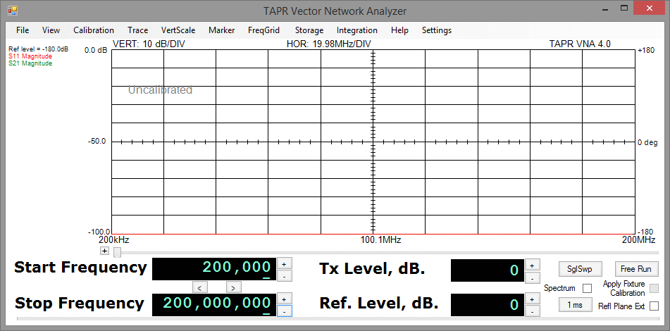
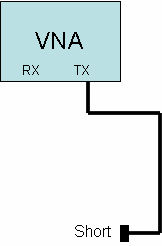
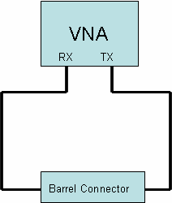
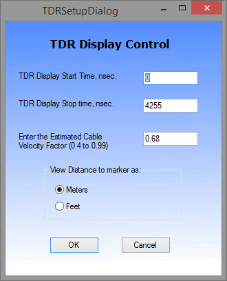
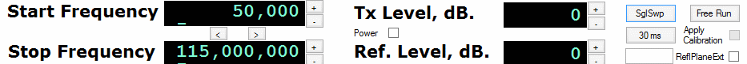
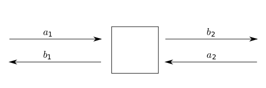

TAPR VNA Software 
Instruction Manual 

 
 
 
preliminary for nanoVNA release 0.2.3 and VNAR4.4 
 
October 7, 2019 

[Previous version](https://github.com/erikkaashoek/Tapr-VNA/blob/master/Doc/Background/TAPR3_Instruction_Manual_Issue_7.pdf) for Ten-Tec VNA  

**Table of Contents**

1.  [Overview](#overview)  
    1.  [Hardware Version Differences](#hardware-version-differences)    
    2.  [Instrument Caution](#instrument-caution)  
    3.  [Temperature Limitation](#temperature-limitation)  
    4.  [Instrument Limitations](#instrument-limitations)  
    5.  [Relative Measurements](#relative-measurements)  
    6.  [Calibration Standards](#calibration-standards)  
    7.  [Hibernation or Suspension of Host Computer](#hibernation-or-suspension-of-host-computer)  
    8.  [Calibration Modes are Single-threaded](#calibration-modes-are-single-threaded)  

2.  [Software Installation](#software-installation)  
    1.  [Initial Software installation](#initial-software-installation)   
    2.  [Supported Operating System Versions](#supported-operating-system-versions)   
    3.  [Software Distribution](#software-distribution)  
    4.  [Installed TAPR Files](#installed-vna-files)  
    5.  [Installation Pre-Requisites](#installation-pre-requisites)  
    6.  [Connecting nanoVNA to your Computer](#connecting-nanovna-to-your-computer)  
    7.  [Uninstall](#uninstall)  

3.  [Fixture Calibration](#fixture-calibration)  
    1.  [Fixture Calibration Data](#fixture-calibration-data)  
    2.  [Partial Changes to Fixture Calibration Data](#partial-changes-to-fixture-calibration-data)  
    3.  [Fixture Setup Diagrams](#fixture-setup-diagrams)  
    4.  [Actual measurement](#actual-measurement)  
    5.  [Fixture Calibration Setups](#fixture-calibration-setups)  
    6.  [Short Fixture Calibration](#short-fixture-calibration)  
    7.  [Open Fixture Calibration](#open-fixture-calibration)  
    8.  [50-ohm Terminated Fixture Calibration](#ohm-terminated-fixture-calibration)  
    9.  [Through Fixture Calibration](#through-fixture-calibration)  

4.  [TAPR Software Menu](#vna-software-menu)  
    1.  [File Menu](#file-menu)  
        a.  [Exporting S-Parameters](#exporting-s-parameters)  
    2.  [View Menu](#view-menu)  
    3.  [Calibration Menu](#calibration-menu)  
    4.  [Trace Menu](#trace-menu)  
        a.  [Rectangular Display Mode](#rectangular-display-mode)  
        b.  [Polar Display Mode](#polar-display-mode)  
        c.  [Time Domain Reflection Mode](#time-domain-reflection-mode)  
    5.  [Device Under Test](#device-under-test)
    6.  [Vertical Scale Menu](#vertical-scale-menu)  
    7.  [Marker Menu](#marker-menu)  
    8.  [Frequency Grid Menu](#frequency-grid-menu)  
    9.  [Storage Menu](#storage-menu)  
    10. [Integration Menu](#integration-menu)  
    11. [Help & Software Updates](#help-software-updates)  

5.  [Controls](#controls)  
    1.  [Frequency Controls](#frequency-controls)  
    2.  [Level Controls](#level-controls)  
    3.  [Apply Calibration](#apply-calibration)  
    4.  [Sweep Controls](#sweep-controls)  
    5.  [Mouse Actions](#mouse-actions)  

6.  [Example Measurement](#example-measurement)  
    1.  [Some Cautions](#some-cautions)  
    2.  [Common Display Results](#common-display-results)  

7.  [Appendix 1 Overview of S Parameters](#appendix-1-overview-of-s-parameters)  
    1.  [Polar Display](#polar-display)  
    2.  [Rectangular Display](#rectangular-display)  
    3.  [Group Delay](#group-delay)  
    4.  [SWR](#swr)  
   
8.  [Appendix 2 Calibration Details](#appendix-2-calibration-details)  
    1. [Detector Calibration](#detector-calibration)  
    2. [S21 Compensation](#s21-compensation)  
    3. [S11 Compensation](#s11-compensation)  
    4. [Fixture Calibration Data Set](#fixture-calibration-data-set)  
 
9.  [Appendix 3 Software Installation, Registry](#appendix-3-software-installation-registry)  
 
10. [Appendix 4 Group Delay and Aperture](#appendix-4-group-delay-and-aperture)  
    1.  [Aperture Shortening](#aperture-shortening)  

Overview
========

This manual provides instructions for using
TAPR Network Analyzer (VNA) software with nanoVNA.
Due care is required in test setup, calibration,
and operational methods to fully realize nanoVNA accuracy.
This manual applies to nanoVNA firmware release 0.2.3.
 
If you are not already familiar
* S-parameters
* forward and reflected magnitude, gain and phase
* polar and rectangular plots
... consider reading **Appendix 1 Overview of S Parameters** before continuing here.
 
A VNA performs measurements on one-port or two-port networks.  
A two-port network has input and output (plus ground(s)).  
A one-port network has only an input (and ground).
The network input is connected to nanoVNA CH0 (TX) connector,
and the network output is connected to nanoVNA CH1 (RX) connector.
 
This VNA is capable of four measurements:

-   `S21` Magnitude -- gain or loss from two-port network input to output.

-   `S21` Phase -- transfer phase from two-port network input to output.

-   `S11` Magnitude -- return from network input port
    referenced to the signal sent to that port.

-   `S11` Phase -- the phase angle of return from network input
    port referenced to the signal sent to that network.

All other measurements are derived from these four.

Hardware Version Differences
----------------------------

See [nanoVNA hardware](https://oristopo.github.io/nVhelp/html/hardware.htm)

Instrument Caution
------------------

The nanoVNA places about a -10 dBm level signal (\~0.1 milliwatts)
onto the CH0 connector during measurements.

Temperature Limitation
----------------------

Overclocked nanoVNA Si5351 is somewhat temperature sensitive.
For best performance, allow nanoVNA to warm for 10 minutes before
calibrating or measuring, but also avoid overheating.
Key nanoVNA temperature dependence is stimulus performance approaching 300/900 MHz.
 
To begin, connect nanoVNA to host by USB cable, turn it on, then launch the TAPR program.

Basic Performance
-----------------
- Power 120mA USB-C
- USB type CDC (virtual COM port) serial console
- Frequency Range 50kHz - 900MHz
- Frequency Tolerance / Stability (ppm) < 2.5 / < 0.5
- Measurement Range 70dB (<300MHz), 50dB (<600MHz), 40dB
- Scan points 101 max
- Port SWR < 1.1
- Display 2/4 traces, 4 markers, 5 stored configurations

Instrument Limitations
----------------------

-   VNA S21 dynamic range is limited by the receiver noise figure (mostly cross-talk).
    S11 dynamic range is limited by bridge directivity,
    then stimulus harmonics power and mixer response above 300MHz. 

-   VNA basic resolution is 0.1 dB for amplitude measurements.
    Phase measurement resolution is 1 degree.

-   The group delay measurement simply differentiates successive phase
    measurements. Consequently, groupd delay calculations will be wrong
    if phase changes more than 180 degrees between successive measurement points.

-   The smallest frequency measurement interval is 1 hertz. Thus the
    span width (STOP Frequency -- START Frequency) must be at least as
    great as the 101 points in the frequency grid.
    For example, the START frequency
    should be at least 101 Hertz greater than the STOP frequency.

-   nanoVNA CH1 return loss is about 15 dB.
    If measurement results critically depend upon a more accurate
    termination, be sure to use a highly accurate attenuator of
    at least 10 dB between the device under test (DUT)
    and the CH1 connector. The VNA fixture calibration
    can do the math for you automatically
    (run a fixture calibration 'through' with the attenuator in place).

-   Frequency source accuracy is determined by an on-board 26 MHz crystal oscillator,

-   The default frequency range on instrument startup is 50 KHz to 900
    MHz. The instrument is capable of operating higher, but
    accuracy is degraded above 300 MHz.

-   The phase detectors are accurate only down to about `20 dB` above the
    noise floor. Thus, the phase component of an `S21` measurement with
    more than about `60 dB` attenuation is not valid. The phase component
    of `S11` measurements is only valid to about `40 dB` return loss.

Relative Measurements
---------------------

nanoVNA measures neither signal magnitudes nor phase delays absolutely.
All measurements are calculated relative to other measurements. In most
cases, this other measurement will be an instrument or fixture
calibration. Measurement accuracies thus directly
depend on reference calibrations.
 
Return measurements are extremely sensitive to fixture configurations.
Great care must be used making `S11` measurements to obtain
reasonably accurate data. For example, a single 50-ohm
connector adaptor less than 1 inch long introduces measurable
phase delay in return signals. Properly set up,
nanoVNA can resolve connector adaptor lengths.  Practically,
calibrations should include connector adaptors as used in
actual measurements.

Calibration Standards
---------------------

Some high quality commercial attenuators are not exactly 50.0 ohms in
impedance. A resistance error of 0.5 ohms in the \"50 ohm terminated\"
calibration step is enough to degrade the return loss dynamic range.
Similarly, quality of SHORTs and OPENs used in fixture
calibration can degrade calibrations. This is one reason nanoVNA
uses SMA rather than BNC connectors for
CH1 and CH0 ports \-- these connectors cause less
discontinuity than other types.
 
Proper calibration needs:
-   a high-quality SHORT with minimal excess inductance,  
-   a high quality OPEN with minimal excess capacitance, and  
-   a high-quality 50-ohm termination with known delay
  

Details:
-   A high-quality SHORT normally consists of a screw-on connector shell
    that shorts the center pin to the outside shell with minimal excess
    inductance. These are manufactured commercially. Alternatively, an
    SMA receptacle with a small disk (with a hole drilled in the
    center), fit over the center pin, and soldered between the pin and
    the connector flange on the rear side minimizes the excess
    inductance and thus makes an acceptable SHORT. Either can be easily
    attached to an SMA cable using an SMA barrel connector.

-   A high-quality OPEN consists of a connector with the projecting
    length of the center conductor beyond the shell insulator minimized.
    An open SMA connector at the end of a cable provides an adequate
    OPEN circuit for the calibration steps because the design of the SMA
    connector provides this feature. A special SMA open provides the
    best termination, but an open connector is adequate for many
    purposes.

-   A `40 dB` attenuator is needed when running the detector calibration
    routine (described in section 3); a high-quality, accurate
    attenuator (or a combination of 2 SMA attenuators) should be used
    for this purpose.

-   One-meter and three-meter cables are needed for detector calibration
    (although exact cable lengths are not critical).

Hibernation or Suspension of Host Computer
------------------------------------------

If the host computer (typically a laptop) hibernates or suspends,
you will have to remove power from nanoVNA and exit TAPR software.
Then reconnect power to nanoVNA and restart the TAPR application.

Calibration Modes are Single-threaded
-------------------------------------

This TAPR software is multi-threaded, meaning that other Windows
programs can run while this software acquires data in the background.
However both fixture and instrument calibration are single-threaded
code. This means that these two calibrations routines will stall if
another Windows program has the *focus*, and will
continue when the TAPR application regains focus. The progressbar may
take awhile to update after the TAPR program regains focus.

Software Installation
=====================

Initial Software installation
-----------------------------

TAPR software is installed from [the Internet](https://github.com/erikkaashoek/Tapr-VNA/raw/master/VNAR4.4.zip).
Additionally, you may need to install the Microsoft Windows© dotNET 1.1 run-time

-   Double-click on the downloaded `VNAR4.4.zip`, which should
    open to reveal `VNAR4.4.exe`. If it does not,
    verify that zip file was not corrupted during download.

-   Launch `VNAR4.4.exe`  
      

-   If alerted that dotNET 1.1 runtime is not found:

    -   Recommended: Install the most recent dotNET 1.1 framework via
        the Internet from the Microsoft website. This will be
        approximately 23 MB in size, and is referred to as the
        redistributable file. You need to download the file for "General
        Users". It will be named `dotnetfx.exe`. This will
        assure that you get the most current version with recent service
        patches. The URL at the time this manual was written is:

[https://dotnet.microsoft.com/download](https://dotnet.microsoft.com/download)

Supported Operating System Versions
-----------------------------------

While VNAR4.3 software may run on Windows operating systems as shown,
nanoVNA support is expected for no older than Windows 7:

<table><tr>
<th>Operating System</th><th>Support</th><th>Notes</th>
</tr><tr>
<td>Windows 95</td><td>No</td><td>Lacks USB support</td>
</tr><tr>
<td> Windows 98 -- Gold</td><td>Maybe</td><td>Supports only USB 1.0 not 1.1</td>
</tr><tr>
<td>Windows 98 SE (Second Edition)</td><td>Yes</td><td>Tested</td>
</tr><tr>
<td>Windows ME</td><td>Probably</td><td>Not tested</td>
</tr><tr>
<td>Windows NT</td><td>Probably</td><td>Not tested</td>
</tr><tr>
<td>Windows 2000</td><td>Yes</td><td>Tested</td>
</tr><tr>
<td>Windows XP</td><td>Yes</td><td>Tested</td>
</tr><tr>
<td>Windows 7</td><td>nanoVNA</td><td>Tested?</td>
</tr><tr>
<td>Windows 8.1</td><td>nanoVNA</td><td>Tested</td>
</tr><tr>
<td>Windows 10</td><td>nanoVNA</td><td>Tested</td>
</tr></table>

Software Distribution
---------------------

The current software distribution consists of:
<table>
<tr><th>Filename</th><th>Function</th></tr>
<tr><td>VNAR4.4.zip</td><td>Installer ZIP file</td></tr>
</table>

Installed TAPR Files
-------------------

`VNAR4.4.zip` includes only `VNAR4.4.exe`  
File locations can be changed...  

<table>
<tr><th>File name</th><th>Where found</th><th>Function</th></tr>
<tr><td>VNAR4.4.exe</td><td>Inside VNAR4.4.zip</td><td>Host program</td></tr>
<tr><td>Help.chm</td><td><a href="https://github.com/erikkaashoek/Tapr-VNA/raw/master/VNAR3%20Help.chm">GitHub</a> Should be in folder with VNAR4.4.exe</td><td>Compiled help file</td></tr>
</table>

Installation Pre-Requisites
---------------------------

VNAR4 software requires that the host have a reasonably current Windows
.NET 1.1 framework run time package installed (version 1.0 is not sufficient).  
[Here is link to the Microsoft web site](https://www.microsoft.com/en-us/download/details.aspx?id=26) providing a download menu if the
pre-requisite is missing. Microsoft has many different programs on
this web page; you need the one that is approximately 23 MB in size,
and is called the "*redistributable*" (it is allowed to be
redistributed by applications).
 
Download and install as needed, the filename is `dotnetfx.exe`.
We recommend downloading the latest
version from Microsoft (its about 23 MB in size). Many newer
applications and some recent Microsoft service packs install the
framework, so you may have it already.

Connecting nanoVNA to your Computer
-----------------------------------

After verifying TAPR program launch, quit it.  
Connect nanoVNA to your computer using a USB cable and power on.
This may provoke Windows "New Hardware Detected Wizard".r
The wizard finds nanoVNA device and attempts to associate a device driver.
When prompted, let the wizard search to find the driver
(since it may have been installed for STM DFU utility).

After Windows has installed a driver and with nanoVNA connected and powered on,
relaunch VNAR4.  If launched before nanoVNA connection, VNAR4 may not detect it.

Uninstall
---------

To uninstall this TAPR application,
use the control panel `add new software` selection,
and use it to uninstall the application. The
uninstaller does not delete the Registry key.
You may delete it manually if you wish, but it's not required.  
See Appendix 3 for details.

Fixture Calibration
===================

Each specific test fixture (test setup) consists of connectors,
cables, adaptors, and other things that affect the `S21` and `S11`
measurements. Each test fixture setup has different physical
properties. For example, the length of each interconnecting test cable
affects the phase of all measurements (due to the propagation time
delay specific to that particular cable). Therefore, each test setup
requires a different set of calibration data to compensate for not
only the test setup, but also propagation delay and other errors internal to
nanoVNA.
 TAPR software can perform these \"fixture calibrations\",  
you can take and save one for each different
measurement set up that you use. Each calibration can be saved with a
different file name. Use as descriptive a filename as possible so that
you can remember exactly what each fixture calibration refers to!
 
Before the Fixture calibration is started, have a 'SHORT', 'OPEN',
'50-ohm TERMINATION', and a Connector Bullet (or barrel) available. As
discussed previously, OPEN is just the open end of an SMA cable with
nothing connected.

Fixture Calibration Data
------------------------

A fixture calibration data set is built from four raw data
measurements -- 'Open', 'Short', 'Terminated', and 'Through'.
 
Typically, the following procedure is used to make a calibration data
run:

1)  The cable from nanoVNA CH0 connector to the device under test
    (DUT) is disconnected *at the DUT*, and is terminated sequentially
    in a series of precision loads:

    1.  The 'Short' calibration is conducted with the zero-ohm load at
        the end of the CH0 cable.

    2.  The 'Open' calibration is conducted with the infinite-ohm load
        at the end of the CH0 cable.

    3.  The 'Terminated' calibration is conducted with the 50-ohm load
        at the end of the CH0 cable.

2)  Then the \"Through\" calibration is performed after putting a
    connector barrel or bullet (usually a double-female connector
    adaptor) in place of the DUT.

3)  The error compensation parameters are computed, and the data set is
    saved with a descriptive filename using the extension `.cal`.

The Fixture Calibration dialog box lists the 4 individual steps needed
to perform the calibration. After each step is completed, and green
check mark will appear next to that step. Follow the steps in order,
and connect the SHORT, OPEN, TERMINATION, and THROUGH fixture setup as
described by each step prior to starting that step. After all the
steps have been completed and each has a check mark present, click the
'SAVE' button.
 
Both interconnecting cables are left in place because they are part of
the measurement error; the calibration removes both the time delay and
any amplitude change they and the connectors cause.
 
The calibration routine makes 1024 measurements, starting at 200 KHz,
and stopping at 120 MHz; it linearly spaces the frequency samples
about 117 KHz apart. It is assumed that the test fixture itself
(without the DUT) does not contain any high-Q resonances. If it does,
large uncertainty will be introduced into the measurements (whether or
not calibrated). The DUT of course can have high-Q resonances, just
not the fixturing or interconnecting cables. When applying
calibration, the software linearly interpolates between the two
calibration frequencies closest to the actual measurement frequency,
and uses that to compensate the measurement.
 
If the \"Open,\" \"Short,\" or \"50-ohm\" loads are not accurate, then
the compensation will be wrong. At 100 MHz, nanoVNA is fairly
sensitive to the accuracy of these loads.
 
Normally, there will be a number of different calibration data sets
taken and stored, one for each test setup. These can have any valid
windows filename (so it's helpful to be descriptive and verbose with
the filename), but the extension is always `.cal`. The \"Apply Fixture
Calibration\" checkbox is `grayed-out` until a valid
Fixture Calibration Data set is loaded.

Partial Changes to Fixture Calibration Data
-------------------------------------------

It's possible to partially update the Fixture calibration data. For
example, assume that the cable from the DUT to nanoVNA CH1
connector is changed. This does not affect the `S11` measurement, but
will change the `S21` measurement. In this case, a previously saved
calibration dataset can be loaded, and just the one measurement
('Through') run, then the dataset saved with a new name or with the
existing name as appropriate. The newly saved data set will inherit
the `S11` raw and derived errors from the older dataset, but will use
the new 'through' measurements. In fact, this can be done with any or
all of the four measurements.

Fixture Setup Diagrams
----------------------

The following three diagrams show how the fixture needs to be setup
during the fixture calibration process, and during the actual
measurement using the fixture. The following dialog box shows the four
steps needed for fixture calibration. The diagrams in this section
show the connection required to perform the individual calibration
steps.

Actual measurement
------------------

The cables, connectors, and adaptors connecting both the CH0 and
CH1 connectors to the DUT are part of the test fixture. These
exact same cables connectors, and adaptors must be left in place
during the Fixture calibration steps, while the DUT itself is removed
and replaced with various loads and connector barrels during the
Fixture Calibration steps.

Fixture Calibration Setups
--------------------------

Only the cables, connectors, and adaptors connecting the CH0 to
the calibration loads are part of the text fixture during the first
three fixture calibration steps. The fourth step also uses the cables,
connectors, and adaptors in the CH1 connection as well in order to
complete the fixture calibration. Typically all the cables,
connectors, and adaptors are left in place, and only the DUT is
removed during the Fixture Calibration steps.
 
Once all four steps are completed, click the "Save Cal Results..."
button. This will allow you to choose a file name and location. Be
sure to use a description filename, as you are likely to have many
different fixture calibration files.
 
Filenames are allowed to be long and may contain embedded spaces. The
software will automatically append a `.cal` suffix to your name.
Filenames are not limited to an 8.3 format, which would not be
sufficiently descriptive.

Short Fixture Calibration
-------------------------

Open Fixture Calibration
------------------------

50-ohm Terminated Fixture Calibration
-------------------------------------

Through Fixture Calibration
---------------------------

The cables, connectors, and adaptors connecting both the CH0 and
the CH1 connectors to the DUT are part of the test fixture.
Additionally, the bullet connector is part of the calibration test
fixture even though it will not be present in the actual measurement.
This represents a source of uncompensated error. Thus the connector
bullet must be short, low loss and impedance-matched to the cables in
order to minimize these errors.

TAPR Software Menu
==================

The following menu items are available in the TAPR program. Each menu
item is explained in the following sections.
 
File
 
View
 
Print
 
Print Setup Print Preview Set Plot title
 
Store Forward Parameters Store Reverse Parameters Export S-parameters
 
Rectangular Format Polar Format
 
Save Configuration ... Load Configuration ... Exit
 
Rectangular Polar
 
Time Domain Reflection
 
Calibration
 
Detector Calibration Run Fixture Calibration
 
Load Fixture Calibration File
 
Trace
 
`S11` Magnitude (rectangular) `S11` Phase (rectangular) `S21` Magnitude
(rectangular) `S21` Phase (rectangular)
 
`S21` Group Delay (rectangular)
 
`S11` Magnitude as SWR (rectangular)
 
Raw Calibration Data `S21` -- Through (rectangular) Et -- Tracking Error
(Polar)
 
Es -- Source Mismatch Error (Polar) Ed -- Directivity Error (Polar)
 
Raw Calibration Data `S11` -- Short (polar) Raw Calibration Data `S11` --
Open (polar)
 
Raw Calibration Data `S11` -- Terminated (polar)
 
Vertical Scale
 
10 dB / division 5 dB / division 2 dB / division `1 dB / division`
 
SWR 1.0 to 11.0
 
SWR 1.0 to 6.0
 
SWR 1.0 to 3.0 `SWR 1.0 to 2.0`
 
10 microseconds / division 1 microsecond / division 100 nanoseconds /
division 10 nanoseconds / division 1 nanosecond / division
`100 picoseconds / division` Group Delay Aperture = 1 Group
Delay Aperture = 4 Group Delay Aperture = 16
`Group Delay Aperture = 64` Right Scale display
 
Phase SWR
 
Delay Polar Zoom
 
Zoom = 1.0
 
Zoom = 1.5
 
Zoom = 2.0
 
Zoom = 2.5 TDR Setup
 
Marker
 
Change Marker Frequencies Clear All Markers
 
Marker Numbers
 
Enable Disable
 
Marker Parameters Enable Disable
 
FreqGrid
 
100 points
 
200 points
 
400 points
 
1020 points Storage
 
Store Recall
 
Display Storage
 
Help
 
Display Help About
 
Launch Browser (to check for Software Updates)

File Menu
---------

The File menu allows printing the measurements in graphical format,
and storing the S-parameters in a text file.
 
Print -- prints the selected view (rectangular or polar) to the
printer.
 
Print Preview -- previews printed page format
 
Print Setup -- allows selecting the desired printer and setting the
print parameters  

Set Plot Title -- allows setting / clearing a textual
title for the plot that appears underneath the scope display
 
Store Forward Parameters -- store the measured reflection and
transmission data as `S11` and `S21` to temporary storage
 
Store Reverse Parameters -- store the measured reflection and
transmission data as S22 and S12 to temporary storage
 
Export S-Parameters -- exports the stored data in text format
Rectangular Format -- Real and Imaginary components of the S-
parameters normalized to 50 ohms
 
Polar Format -- Magnitude, in dB, and Phase in degrees of the S-
parameters normalized to 50 ohms
 
Save Configuration -- Saves the complete state of the instrument
settings and display traces to a file (except stored S-parameters).
The filename can be selected and should be very descriptive.
 
Load Configuration -- Loads a previously saved configuration file to
restore the state of the instrument from a previous measurement setup.
 
Exit -- immediately terminates the TAPR application (and saves the
current instrument configuration to the file: `last.cfg`.

### Exporting S-Parameters

The VNA is a reflection-transmission test set. It can only measure
half of an S- parameter data set (S11 and `S21` in the forward
direction) at one time. The DUT must be physically reversed in the
test setup in order to measure the other direction (S12 and S22 in the
reverse direction).
 
To measure and export a complete 4 parameter set:

-   First set the frequency sweep (start and stop frequencies), and
    apply calibration as desired.

-   Make a measurement sweep in the forward direction

-   Store Forward Parameters.

-   Next, physically reverse the DUT (exchange input and output).

-   Make a measurement sweep in the reverse direction without changing
    the frequency sweep or calibration-applied boxes.

-   Store Reverse Parameters

-   After these two datasets have been stored, you may Export the S-
    Parameters in either the Rectangular or Polar formats to a text
    file.

Both the forward and reverse storage arrays are locked once stored;
this prevents accidental over-write. The menu items appear with a
checkmark when
 
locked. The only way to unlock them is to Export the file. Both
forward and reverse arrays must be filled before the Export function
can work.

View Menu
---------

The View menu allows selecting the display view:

1)  Rectangular

2)  Polar

3)  Time Domain Reflection

The Rectangular display can display `S11` magnitude and phase, and S21
magnitude, phase, and group delay. It can also show `S21` ('Through')
calibration parameters. Magnitude is plotted as dB vs. frequency,
phase is plotted as degrees vs. frequency, and group delay is plotted
as time vs. frequency. The display units (dB/div, and seconds/div) can
be selected in the VertScale menu.
 
The Polar display can display `S11` (reflection measurement) and the
calibration data associated with reflections measurements. The Polar
display does not show `S21` measurements.
 
The Time Domain Reflection (TDR) mode performs a reflection
measurement then converts from a frequency measurement into the real
part of the time domain response. It displays the TDR response versus
time. It is useful for testing cables for faults. The TDR markers will
calculate the distance from the reference plane to the point indicated
by the marker. The TDR resolution is 4.1 nanoseconds. This limits the
resolution of the cable fault to about 1.3 feet (or about 0.4 meters).
The TDR mode ignores the Start and Stop frequencies, it needs to setup
a custom grid.

Calibration Menu
----------------

The Calibration menu provides three options:

1)  Generate (and save) a Detector calibration data set.

The detector calibration data set is auto-loaded by the application if
it exists. It does not normally need to run except the first time the
instrument is used. Only one detector calibration file is needed.

2)  Run (Generate, load, and save) a fixture calibration data set.

A separate fixture calibration set is needed for each different test
fixture.

3)  Load a previously saved test fixture calibration data set by name.

The Detector calibration procedure is described in section 3. The
Fixture calibration procedure is described in section 4.
 
**Appendix 2 Calibration Details** provides a more detailed
description of how the calibration routines work.

Trace Menu
----------

The Trace menu allows selecting which measurements are displayed. The
Polar display only displays reflection measurements (S11) and related
raw and derived calibration constants. The rectangular display can
show both `S11` and `S21` measurements, and the calibration constants
related to S21.

### Rectangular Display Mode

`S21` can be displayed only on the rectangular display.  
`S11` can be displayed on both the rectangular and polar displays.  
Traces supported by Rectangular display are:
<table>
<tr>
<td>S11 Magnitude</td><td>Device Under Test (DUT) input return loss magnitude, in dB</td>
</tr><tr>
<td>S11 Phase</td><td>DUT input return loss phase angle, in degrees, from +180 to --180</td>
</tr><tr>
<td>S21 Magnitude</td><td>DUT forward transfer gain (or loss) magnitude, in dB</td>
</tr><tr>
<td>S21 Phase</td><td>DUT forward transfer phase, in degrees</td>
</tr><tr>
<td>S21 Group Delay</td><td>DUT forward transfer gain (or  loss) derived group delay</td>
</tr><tr>
<td>S11 Magnitude as SWR</td><td></td>
</tr><tr>
<td>S11 as R Ohms</td><td>S11 real value converted to Ohms</td>
</tr><tr>
<td>S11 as jX Ohms</td><td>S11 quadrature value converted to Ohms</td>
</tr></table><table><tr>
<td>Raw Calibration Data - S21thru</td>
<td>Raw data taken from the through VNA connection CH0 to CH1 
    (through cables actually connecting to the DUT)</td>
</tr></table>

### Polar Display Mode

`S11` (as a polar complex number) is always displayed on the Polar display.
`S21` *cannot* be displayed on the polar display.
Raw calibration data (from a calibration file that is loaded)
as well as error parameters derived from calibration data can be displayed.
Normally, error compensation and raw error data are for informational purposes only
and are not displayed.
 
Traces that can be added to Polar mode display are:
<table>
<tr>
<td>Et -- Tracking Error compensation</td><td>complex plot of amplitude and phase 
                                              for cable from nanoVNA CH0 to the DUT</td>
</tr><tr>
<td>Es -- Source Mismatch Error compensation</td><td>complex error plot for imperfect source impedance termination</td>
</tr><tr>
<td>Ed -- Directivity Error compensation</td><td>complex error plot due to finite directivity in the bridge</td>
</tr></table>
<table><tr>
<td>Raw Calibration Data - S11short</td><td>for shorted CH0 during calibration (or loaded from a calibration file)</td>
</tr><tr>
<td>Raw Calibration Data - S11open</td><td>for unterminated CH0 during calibration (or loaded from a calibration file)</td>
</tr><tr>
<td>Raw Calibration Data - S11term</td><td>for CH0 terminated by "known" 50-ohm load during calibration (or loaded from a calibration file).</td>
</tr></table>

### Time Domain Reflection Mode

The TDR mode displays the real part of the Inverse Fast Fourier
Transform of a reflection measurement. Because the TDR mode requires a
specific custom frequency grid, it ignores the Start and Stop
settings. When switching to the TDR mode, a new Frequency Grid is
created. Thus, a new sweep is required. Click the sweep button. A
`TDR interpretation of existing `S11` sweep data is not meaningful` 
and should be ignored, instead re-acquire the
reflection measurement after you have selected the TDR mode. The
'Apply Calibration' checkbox sets the reference plane for the TDR
analysis. When the 'Apply Calibration' box is checked, distances
specified on the TDR display are with respect to the reference plane
(the end of the cable calibrated with the Short, Open, and Termination
loads).
 
The display Start time, display Stop time, and estimated velocity
factor of a cable under test are specified in the TDR Setup dialog,
reached from the Vertical Display menu. Additionally, distances from
the Reference Plane to the Marker point can be displayed in METERS or
FEET.
 
TDR mode resolution is limited by a VNA's maximum stimulus frequency.
It is possible to infer between TDR points by visually
interpolating. For example, if two consecutive TDR points have the
same large time reflection, the actual time position will lie in
between those two consecutive times.

Device Under Test
-----------------

The reflection and forward measurements are made with respect to the
Device Under Test (DUT). The reference plane location is established
when the fixture calibration is run and loaded.

Vertical Scale Menu
-------------------

The Vertical Scale menu allows independently selecting the vertical
scale units per division for magnitude (in dB / division), the maximum
SWR display (minimum is always 1.0), the group delay (seconds per
division), and the aperture size of the group delay computation.
 
For more information see **Appendix 4 Group Delay and Aperture**
for more details on how group delay is derived and how the data can be
smoothed (or distorted) by changing the aperture size.
 
Note that for small frequency spans, the noise of the group delay
measurements is magnified significantly due to the small difference
frequency between adjacent samples. For best results, use the largest
aperture window, and the largest number of gridpoints in order to
reduce the measurement noise for narrow sweeps. However, large
apertures may smooth the data beyond the range of interest, so care
must be used to select an appropriate aperture size.
 
Magnitude. The display resolutions selectable are:  
10 dB / div `5 dB / div` 2 dB / div `1 dB / div` 0.5 dB / div
 
SWR Scale selections are:  
SWR 1.0 to 11.0  
SWR 1.0 to 6.0  
SWR 1.0 to 3.0  
SWR 1.0 to 2.0  
 
Impedance Scale selections are:  
1k Ohms / div  
100 Ohms / div  
10 Ohms / div  
 
Right Scale Display selections are:  
Phase  
SWR  
Delay  
Ohms  
[rectangular] Right Scale Display values adjust to selected vertical scale factors.
 
Group Delay Time Scale selections are:  
1 millisecond / div     
100 microsec / div     
10 microsec / div   
1 microsec / div   
100 nanosec / div  
10 nanosec / div   
1 nanosec / div   
100 picosec / div  
 
Group Delay Aperture  
-   the number of adjacent frequency bins over which group delay is measured.   
Group Delay Aperture = 1  
Group Delay Aperture = 4  
Group Delay Aperture = 16  
Group Delay Aperture = 64

Polar Zoom Factor applies a zoom factor to polar displays.
The default value is 1.0, representing normal Smith Chart display,
with a reflection coefficient of 1.0 lying on the chart periphery.
Increasing zoom keeps the 50 + j0 point the centered 
and displays impedances near 50 + j0 with more resolution.
A zoom factor of 2.0 places reflection coefficient values of 0.5 on the chart periphery.
There are four display zoom settings:
Zoom = 1.0  
Zoom = 1.5  
Zoom = 2.0  
Zoom = 2.5  
 
TDR Setup allows
-   setting TDR Display Start and Stop times (in nanoseconds).
    This enables zooming to areas of interest.
-   entering an estimated cable velocity factor value,
    which is used to calculate distances from the reference plane
    to marker points (perhaps a cable fault).
    The valid range is 0.4 to 0.99.
-   selecting Meters or Feet for distance display  

Marker Menu
-----------

The Marker menu allows setting up to five marker frequencies,  
and enabling or disabling the display of marker numbers and their parametric values.
 
Markers can also be set by *left-clicking* on the display at a
frequency of interest. The first unused marker will be loaded with the
frequency corresponding to the position of the mouse. If the mouse is
moved before releasing the left button, the marker is *dragged* across
the screen. If the left button is clicked and held on an existing
marker, that marker can be dragged instead of dropping a new marker
(but you have to very accurate in pointing the mouse -- especially at
high display resolutions). If all markers are in use, then the
left-click will not create a new one but can drag an exiting one. The
screen parameters update in real-time as the marker is dragged.
 
A value of 0 effectively disables marker display (since 0
will always be off the left side of the display screen). Any marker
with a value of 0 is considered unused. It can be used by entering a
displayable value in the marker entry menu.
 
Additionally, the first unused marker will be assigned anytime the
mouse is left- clicked.
 
The frequency of interest is readily apparent on the rectangular
display, but not so on the polar display. You will however be able to
see the marker move as you drag the mouse left and right. If marker
parameters are enabled, you will be able to see a reading indicating
the marker frequency while in the polar display mode. The marker may
appear to move backwards compared to the mouse movement if the polar
display is showing `S11` in the lower (capacitive) half of the display.
 
Vertical (up/down) movement of the mouse does not change the marker
frequency.
 
The Marker parameters are color-coded to match the color of the
corresponding trace on the display.
 
Parametric values `S11`, `S21`, and `SWR` are displayed only if the
associated trace display is enabled.
 
Change Marker Frequency -- Allows setting any of the five marker
frequencies. A marker set to a frequency that is smaller than
startFrequency or larger than stopFrequency will not display. Thus,
setting a marker to zero will disable its display.
 
Clear All Markers -- Sets all markers to zero, thus disabling their
display. Marker Numbers
 
Enable -- displays the marker number above each marker. Disable --
turns off the marker number, showing just the markers.
 
Marker Parameters
 
Enable -- displays the marker parametric value(s) underneath marker
frequency.
 
Disable -- turns off the marker parametric display.

Frequency Grid Menu
-------------------

The FreqGrid menu allows selecting a Frequency Grid point count,
the number of measurements made from Start to Stop Frequency.
Allowed values are:
<table>
<tr>
<td>100 Points</td><td>Coarsest frequency display, but fastest measurement data acquisition</td>
</tr><tr>
<td>200 Points</td><td></td>
</tr><tr>
<td>400 Points</td><td></td>
</tr><tr>
<td>1020 Points</td><td>Finest frequency display, but slowest measurement data acquisition</td>
</tr></table>

The instrument defaults to 200 points at startup. More points allows
greater resolution in the display, fewer points shortens the
measurement time period. The current setting of the number of points
also affects the exportation of an S- parameter text file, which will
have the same number of individual frequency records as the number of
points in the grid. The calibration runs are fixed in size at 1024
frequency points. When the 'Apply Calibration' box is checked, each
point in the current frequency grid is interpolated to the nearest
calibration frequency point, and the calibration results from that
nearest point is applied to the measurement. Calibration points are
about 117 KHz apart, so the nearest one is no farther than 59 KHz
away. Unless the fixture has resonances (which is very bad anyway) the
error due to interpolation for any size of frequency grid will be
negligible except for very long cables.

Storage Menu
------------

The Storage menu allows storing the current measurement set into
temporary memory. This temporary memory will retain that measurement
set until the program is terminated, or a new measurement set is
stored. A new stored measurement set over-writes the existing
measurements in storage.
 
There are three options in the Storage menu:  
Store  
Recall  
Display Storage
 
'Store' captures the complete raw measurement set  
(whether or not the traces are displayed) and stores it to memory.
 
'Recall' retrieves the measurement set from memory and over-writes the
current active measurement set.  
It does not delete or alter the raw data in storage.
 
'Display Storage' is a toggle that is checked when storage contents are displayed.
 
A common use of the storage function is to make a measurement, verify
it's useful, then 'store' the data.  
Next, some change to the device under test is made and a new measurement is made.  
Enabling the Display Storage option allows comparing on-screen the two measurements.
 
The markers are only attached to the active display set, MARKERS ARE
NOT ATTACHED TO THE STORED DATA. This helps to distinguish which data
on screen are active and which are storage. If you need to use markers
on the stored data, that data should be retrieved to the active set
using the 'recall' menu item.

Integration Menu
----------------

The Integration menu allows multiple sweeps of the instrument to be
averaged together. The value of 1x mean no integration. The value of
2x means that the readings will average the previous sweep with the
current sweep. Values of 4x, 8x, and 16x uise exponential integration
to average the results. This means for example, that at 16x, the scope
display will be equal to 15/16 of the old display value plus 1/16 of
the new value. When the Integration selection is changed, the
integrator is RESET. This means that the next sweep will display the
raw values from a single sweep. Subsequent sweeps will integrate.
Changing the Frequency Grid size will also reset the integrator.
 
Resetting the integrator prevents a large offset from taking a long
time to clear out of the integrated value, and can be useful when
making changes to the unit under test and it is not desired to wait to
see the initial results.

Help & Software Updates
-----------------------

The help menu launches the HTML Help viewer with the TAPR help menu.
 
The About command opens an 'about TAPR' menu. This menu displays the
current build number of the software
 
It also contains a button to launch your Internet Browser with the
address of the TAPR software update website. This will display a
page showing the current TAPR software available. You can
compare your build number with the latest build available number shown
on the web page. Be sure to REFRESH your web browser display.  
If you wish, you may download the update from here (right-click, and Save as ...)
 
Exit the TAPR application before installing updates.

Controls
========

TAPR window controls change start & stop frequencies, reference & transmit signal levels, and sweep functions.
  
 Those controls are not shown on printed outputs.

Frequency Controls
------------------

The frequency controls set the START and STOP frequencies of a sweep.
The arrows increment or decrement the frequencies. The control can be
set to a specific value by double-clicking the control, which will open a
numeric entry dialog box allowing the desired frequency to be typed
directly.
 
Both START and STOP controls display an underscore character
underneath one of the digits. This digit is the one that will be
incremented or decremented by the up or down arrows. The left and
right arrow allow changing which digit position is selected. The
controls will not increment above 120,000,000 Hz, nor below 200,000
Hz.
 
The STOP frequency must be greater than the START frequency by the
size of the frequency grid. If the grid size is 400 points, for
example, STOP must be at least 400 Hertz greater than START.

Level Controls
--------------

The Reference Level control adjusts how the magnitude data are
displayed on the display screen. The value in the control specifies
the magnitude level of the top line of the display screen. When it is
set to 0 dB, the top line of the display is 0 dB. Changing the
Reference Level allows you to optimize the trace location.
 
For example, if the DUT has an attenuation of approximately `22 dB`,
then it could not be displayed at a scale of 1 dB / division, because
it would be off the bottom of the screen. Setting the Reference Level
control to `-20 dB` would allow the screen to show the range of `-20 db`
to `-30 db` at 1 db/division, making the trace visible.
 
The Reference Level control can also be set to positive values. This
is useful when measuring DUTs (such as amplifiers) with output
magnitudes near or above `0 dB`.  
Note that VNA dynamic range extends only a few dB above `0 dB`.  
_External attenuators should be used with DUT's having any amount of gain._
 
The on-screen amplitude display values on the left-side of the display
screen automatically adjust when you change the value of the reference
level. It is sometimes useful to set the reference level to a small
positive number when measuring a low-loss DUT to make sure the markers
and marker numbers display properly.
 
The Transmit Level control should normally be left at 0 dBm.
Decreasing the value of the control will usually degrade the dynamic
range and accuracy of both the `S11` and `S21` measurements.
However, reduce drive level to DUT's with gain can be useful. The
control has about 50 dB of adjustment range, but nanoVNA dynamic range
consumes 40 dB of that range. Thus, `S21` magnitude measurements
effectively support less than `10 dB` of level change. A much
better approach is to attenuate Transmit signals to DUT's with
attenuators. Additionally,
reducing Transmit level seriously degrads `S11` measurements.
 
Magnitude values displayed automatically track changes in
Transmit Level. By the way, one valid use for the Transmit Level
control is to adjust output level when using the VNA as a
signal generator and measured values are of no concern. In this
case, the control can change transmit output
signal level over a 10 dB range.

Apply Calibration
-----------------

The apply calibration check box is grayed-out unless a fixture
calibration data set has been loaded (see calibration menu). Checking
the Apply Calibration box will compensate all readings by the
corrections contained in the loaded fixture calibration set.
Un-checking the box disables the reading corrections.
 
Measurements without any fixture calibration are not accurate, since
there are uncompensated errors in cable length, fixture attenuation,
etc. Further, some VNA instrument errors such as PC board trace
lengths and amplitude variations are not removed if the measurement is
uncalibrated. For best accuracy, measurements should have fixture
calibration applied.

Sweep Controls
--------------

There are three buttons on the screen that control how the TAPR
acquires data. These three buttons are:

-   Sweep Speed

-   Single Sweep

-   Free-run Sweep

The Sweep Speed button determines the sweep dwell time for each
measured sample, and if nanoVNA data are checked for measurement
glitches. If set to the Fast mode, the VNA sweeps as fast a possible,
and does not check the reading data for measurement glitches. As the
button is successively clicked, the sweep speed will be set to the
following values:
-   30 microseconds
-   100 microseconds
-   300 microseconds
-   1 millisecond
-   3 milliseconds
-   10 milliseconds

The button recycles back to Fast after the 10 ms step. When the button
displays any time value (but not Fast), more extensive comparison of
the measured data is used to try and reject obviously defective
individual data points (not always successfully). In the Fast mode
these checks are bypassed, sometimes resulting in momentary glitches
in the measured data. However, the Fast mode sweeps much than any of
the timed modes.
 
The single sweep mode triggers nanoVNA one time, and holds the
measured data after that single sweep.

The Free-run sweep button causes the VNA to trigger continuously
(recurrently), so that the sweep updates as rapidly as possible.
Pressing the Free-run sweep button a second time stops the recurrent
sweeping. The frequency grid button is grayed-out when the VNA is
sweeping, since the number of points cannot be changed during a sweep.
 
One very useful setup is to use a small frequency grid, for example
100 or 200 points, fast sweep mode, and recurrent sweep. This allows
the display to update rapidly, and may be particularly useful when
tuning a DUT such as a filter or antenna in real-time.

Mouse Actions
-------------

The mouse left and right buttons can be used to perform several
different actions on the screen display.
 
The **Left mouse button** can be clicked while in the rectangular
display mode to drop a marker at the frequency where the mouse points
horizontally. If the left button is held down, the marker can be
dragged left and right. The marker freezes when the left button is
released. An existing marker can be grabbed with the left mouse and
dragged, but it takes very precise aim, and is pretty difficult to do
in practice. It's usually easier to bring up the Marker menu, disable
that particular marker (by entering a value of zero) and then droping
and draging a new marker with the mouse. Alternatively, the cursor can
be set coarsely with the mouse, and then the Marker Menu used to set
the frequency precisely.
 
The **Right mouse button** provides a reading of the screen
coordinates exactly where the mouse is pointing (whether or not there
are any traces near the mouse). This works in both rectangular and
polar modes. The popup window will stay in place until the mouse is
moved a few pixels at which point it will disappear.

Example Measurement
===================

The following general steps are used to measure a device under test, 

1.  Make sure that detector calibration has been run  
    (you do not get a warning message on program startup).

2.  Connect cables and adapters from the device under test (DUT) to nanoVNA.

3.  Either run a Fixture calibration on these cables and adaptors, or
    load a previously saved fixture calibration for these exact same
    cables and adaptors.

4.  Remove any shorts, or through connector barrels, and replace with
    the DUT connected from CH1 to CH0.

5.  Run a sweep of the DUT.

6.  Enable the Fixture Calibration checkbox on screen. This checkbox can
    be selected or deselected at any time (before or after the sweep).

Let's look at an example DUT, a low pass filter. A single sweep of
data captures all the data points shown in the following three screen
shots. The different screen shots are just different views of the
single data set.

This screen shows GREEN -- the `S21` transfer magnitude (forward
gain/loss). The screen in set for 10 dB / division. RED is the S11
return loss of the filter, again at 10 dB / division. The filter has
about `60 dB` loss at 50 MHz, degrading a bit at 100 MHz. The return
loss of the filter is about 10-15 dB in the filter passband (200 KHZ
to 40 MHZ) and is `0 dB` in the stopband (above 40 MHz).
 
This type of filter is called a *"reflective filter"* since it
generates a stopband by reflecting the input signal back.
 
On the next screen, the `S11` (RED) trace has been turned off and only
the `S21` (GREEN) trace is displayed. Five markers have been set, and
the display of marker parameters has been enabled. Here we can see
that the insertion loss of the filter is quite good, only about `0.1 dB`
in the passband, and that the `-3 dB` frequency is about 39.85 MHz.
 

 
The last figure shows input return `S11` on a polar chart.
Four markers (which must be set in the rectangular display mode) are
selected, and marker parameter display is again enabled. The markers
show the input magnitude and phase as well as the equivalent input
impedance of the filter at each marker frequency. The filter spirals
outwards from the origin, but stays between the SWR=1.5 and SWR=2.0
concentric bull's eyes until it reaches the stopband frequency, when
it rapidly spirals out of the center toward the periphery of the
chart. The light gray concentric SWR circles on the polar chart are:
-   SWR = 1.5 (Innermost)
-   SWR = 2.0
-   SWR = 3.0
-   SWR = 5.0
-   SWR = 10.0 (Outermost)

Due to small ripple errors in the directional coupler, the stopband
return loss is calculated as negative a few tenths of a dB (which is
wrong). This is shown at marker 4. The polar chart is very non-linear
and changes in return loss of tenth's of a dB cause the distance from
the center of the chart to change a lot when the return loss is near
zero dB, but these changes are minimal when the return loss is more
than a few dB.
 
TAPR software currently compensates for frequency dependent errors.
Starting with version 1.4 the software models the coupler V/I tracking
error and coupler directivity. It compensates readings by subtracting
the coupler directivity and applying a sinusoidal magnitude correction
vs. detected phase angle to `S11` readings.

By the way, these plots are of a high-quality Bencher YA-1 low-pass-filter designed for HF amateur radio.

[Other example measurements](https://github.com/erikkaashoek/Tapr-VNA/tree/master/Doc/Measurement%20examples)  

Some Cautions
-------------

-   High quality variable attenuators may have several tenths of a dB
    loss at their `0 dB` setting. This must be taken into
    account when characterizing filter insertion loss.

-   Attenuator resistance may not be exactly 50.0 ohms. This
    will degrade 50-ohm calibration.

-   Attenuators have finite length. Thus an attenuator inserted
    (or removed) after fixture calibration impacts phase angles of the
    setup from the Fixture correction because the distance to the 'SHORT'
    and 'OPEN' used for fixture calibration has changed.

-   VNA CH1 connector input impedance is only approximately 50 ohms.
    When measuring returns of networks with minimal attenuation,
    phase and amplitude components may include errors due to
    this CH1 connector deviation from an ideal 50 ohm load.
    To improve the measurement either:

    -   Terminate the unit under test with a 50 ohm termination prior to
        `S11` measurements, or

    -   Insert 10 dB attenuation between DUT output and VNA CH1 connector.
        This will assure that the DUT sees more accurate 50 ohm termination
        impedance.

Common Display Results
----------------------

Some common measurements will result in the displays shown in this
section. These can be used to verify that you have correctly
calibrated and setup the VNA and the test cables. These results are
typical, but you may realize slight differences depending on the
cables, instrument measurement errors, etc.
 
Also, there may be minor variations between consecutive instrument
sweeps due to measurement variation or other artifacts. These sweeps
were performed in the 'Slow' mode.

-   Shorted cable -- with and without cable calibration. The following
    charts show the polar and rectangular displays of a shorted cable on
    the CH0 connector. The fixture calibration was performed with
    the same cable and short as the measurement, so the fixture and
    amplitude compensation should match (excepting sweep-by-sweep
    measurement errors, instrument temperature change, etc.).

*3 meter cable terminated in 'Short' `without` fixture calibration applied.*

*3 meter cable terminated in 'Short' `with` fixture calibration applied.*

-   Open cable -- with and without cable calibration. The following
    charts show the polar and rectangular displays of an open cable on
    the CH0 connector. The fixture calibration was performed with
    the same cable as the measurement, so the fixture and amplitude
    compensation should match (excepting sweep-by-sweep measurement
    errors, instrument temperature change, etc.).

*3 meter cable terminated in ''Open' `without` fixture calibration applied.*

*3 meter cable terminated in ''Open' `with` fixture calibration applied.*

-   Terminated cable -- with and without cable calibration. The
    following charts show the polar and rectangular displays of a
    reasonable quality 1 meter 50-ohm cable terminated with a 50-ohm
    load on the CH0 connector. The fixture calibration was
    performed with the same cable and termination as the measurement, so
    the fixture and amplitude compensation should match (excepting
    sweep-by-sweep measurement errors, instrument temperature change,
    etc.).  
     __Note__: many cables and adapters connected to nanoVNA
    may exhibit much poorer return loss than shown here.

*1 meter cable terminated in 50-ohm load `without` fixture calibration applied.  
Polar scale is zoomed 2.5:1 to show more details.*
 

*1 meter cable terminated in 50-ohm load `with` fixture calibration applied.   
Polar scale is zoomed 2.5:1 to show more details.*

*Rectangular display of S11 for 1 meter cable terminated by 50-ohm load `without` fixture calibration applied.*  
 

*Rectangular display of S11 for 1 meter cable terminated by 50-ohm load `with` fixture calibration applied.*  

Appendix 1 Overview of S Parameters
===================================

This overview briefly covers the basics of reflection and transmission
measurements using S-parameters, and visualization of them on
rectangular and polar displays.
 
A linear two port device can be characterized by the behavior of the
voltage returned to voltage injected at the ports. The S-parameter
model provides all the linear characteristics of a two port device at
discrete spot frequencies. S- parameters describe input return,
forward gain, reverse gain, and output return each as a
complex number at a single frequency. For each discrete frequency,
these 4 values describe the behavior of the two port device. To
characterize a device, the S-parameters are usually measured at a
number of different frequencies.
 
In the diagram below, `a1` in the voltage input to port one, and `a2` is
the voltage input to port two; `b1` is the voltage out of port one,
while `b2` is the voltage out of port two. S-parameters are defined
as voltage ratios. `S11` (input return) is the ratio
b1/a1. `S21` (the transfer gain) is the ratio of `b2/a1`. The voltage
exiting port one of the block is the sum of the input return loss time
the input voltage plus the reverse gain times the voltage injected
into port two of the block. The S-parameters are defined in the
following two equations:

#### b1 = a1 \* S11 + a2 \* S12
#### b2 = a1 \* S21 + a2 \* S22

A VNA is really a transmission-reflection test set.
It applies stimulus `a1` to port one of the device while
measuring `b1` and `b2`, then calculates `S11`
(because `a2` is zero).

-   port 2 of the block receives no stimulus (`a2` = 0).
    To derive values for `S12` and `S22`,
    swap ports in the test fixture
    so that VNA stimulus becomes `a2`.

`S11` and `S21` are generally both complex numbers -- in other words,
devices reflect energy back to the input for any spot frequency
with reflection magnitude and phase both generally non-zero.
Similarly, two-port devices typically change both amplitude
and phase of `b2` from `a1`.
The VNA measures and displays input reflection loss
and forward transmission gain as complex numbers.

Polar Display
-------------

Since reflection ratio `S11` is always less than or equal to unity
for passive networks, the value can be displayed in magnitude/phase
format on a polar chart. In general, we expect the forward gain to be
composed of both gain and loss values, so it may exceed unity. This
makes displaying it on a polar chart difficult, since the outside
circle of the polar chart constitutes a magnitude value of unity. Note
that the polar chart does not have any concept of frequency. All
different spot frequencies are displayed on the polar chart. The
software connects the dots in order to show a line. But it's not
always easy to determine what position on the line is at which
frequency. The polar chart makes it easy to see what the real and
reactive components of the input impedance are at any point. Thus, the
polar chart makes the visualization of the important characteristics
of `S11` very easy.
 
The polar value of `S11` is plotted directly on the polar chart, with
the `S11` vector beginning at the center of the chart, the length of the
vector being the magnitude of the return loss, and the direction of
the vector being the phase angle of S11.
 
The left side of the chart corresponds to a direction of +180 or -180
degrees, and is the low-impedance area of the chart. The right side of
the chart corresponds to a direction of 0 degrees, and is the
high-impedance area of the chart.

Rectangular Display
-------------------

It is also possible to display the `S11` and `S21` values on a rectangular
display. In this case, the magnitude of the return loss is displayed
vs. frequency. This makes it easy to read how large the return loss is
at any given frequency, but it's difficult to understand how reactive
or resistive the input impedance really is. In contrast, we don't
usually care too much about the transfer impedance of a network, but
we do care about its gain vs. frequency, and its phase delay vs.
frequency. The rectangular chart makes the visualization of the
important characteristics of `S21` very easy.
 
The magnitude of the return loss of the transfer gain/loss of the
network is expressed in dB on the right side of the rectangular chart.
The phase of the return loss or the phase of the transfer gain is
plotted as degrees vs. frequency. The top line of the rectangular
chart is +180 degrees, while the bottom line is - 180 degrees. The
rectangular chart 'wraps around' from the bottom to the top because a
phase angle of -180 degrees is the exactly the same as a phase angle
of +180 degrees. Thus the top line and the bottom line of the
rectangular chart represent precisely the same phase value.
 
This causes a confusing display when the phase value is 180 degrees,
but varies a few tenths of a degree above and below the value 180.0.
It would normally be a straight line, but the rectangular display will
show it as a trace that varies wildly up and down the screen, first
close to the top line, then alternatively at the bottom line, and then
back again at the top line.

Group Delay
-----------

Sometimes it's desirable to know the time delay properties of a
network. The group delay of a network is the negative of rate of
change of phase with respect to frequency. Group delay is sometimes
useful in determining the electrical length of a network such as a
cable or stub. The electrical length of a cable usually differs from
the physical length due to the velocity factor of the cable.
 
Thus, the group delay computation, along with a physical measurement
of the cable length allows computing the velocity factor of a cable.
 
The phase velocity of a cable is simply the time delay of the speed of
light traveling the length of the cable divided by the actual time
delay of the cable. Suppose a 10 foot piece of cable has a measured
delay of 15 nanoseconds. The speed of light is 11.8 inches per
nanosecond (very close to 1 nanosecond per foot).
Ten feet of free space would have a light speed delay of
120/11.8 = 10.17 nanoseconds. Thus the velocity factor of this cable
would be:
 
`10.17 nanoseconds (free space delay)` 15 nanoseconds (measured delay)
 
or a value of 0.68.

SWR
---

The SWR of a network at any specific frequency is a description of how
well the network input looks like a 50 ohm non-reactive load when the
output of that network is terminated in 50 ohms. An SWR of 1.0 means
that the network has exactly a 50-ohm input impedance. SWR is directly
related to the _magnitude_ of input return, ignoring
input reflection phase, so it is a real number.
`S11` is a complex number representing both magnitude and
phase angle of input return loss.
 
An SWR of 2.0 means that the input impedance is either 25 ohms
resistive, 100 ohms resistive, or some complex value ranging between
those two impedances, and containing non-zero reactance. The value of
SWR does not tell us which of these cases the network looks like,
whereas `S11` does.
 
On the polar chart, each constant value of SWR describes any impedance
lying on a circle centered on the center of the polar chart. The
center of the polar chart is 50+j0 ohms, an SWR of 1.0 (the circle is
a point). Higher values of SWR produce circles of increasing radius
centered on the chart center point. An SWR value of infinite is a
circle lying at the outside periphery of the polar chart.
 
This table relates SWR to input return loss magnitude: <table> <tr> <th> SWR </th><th> Return Loss (dB)</th>
</tr><tr>
<td>1.00 </td><td> infinite</td>
</tr><tr>
<td>1.03 </td><td>36.60</td>
</tr><tr>
<td>1.05 </td><td>32.25</td>
</tr><tr>
<td>1.10 </td><td>26.45</td>
</tr><tr>
<td>1.15 </td><td>23.12</td>
</tr><tr>
<td>1.20 </td><td>20.83</td>
</tr><tr>
<td>1.30 </td><td>17.70</td>
</tr><tr>
<td>1.40 </td><td>15.56</td>
</tr><tr>
<td>1.50 </td><td>13.98</td>
</tr><tr>
<td>1.60 </td><td>12.74</td>
</tr><tr>
<td>1.70 </td><td>11.73</td>
</tr><tr>
<td>1.80 </td><td>10.88</td>
</tr><tr>
<td>1.90 </td><td>10.16</td>
</tr><tr>
<td>2.00 </td><td>9.54</td>
</tr><tr>
<td>2.50 </td><td>7.36</td>
</tr><tr>
<td>3.0</td><td>6.02</td>
</tr><tr>
<td>4.0</td><td>4.44</td>
</tr><tr>
<td>5.0</td><td>3.52</td>
</tr><tr>
<td>10.0</td><td>1.74</td>
</tr><tr>
<td>20.0</td><td>0.87</td>
</tr><tr>
<td> infinite </td><td>0.00</td>
</tr>
</table>

Appendix 2 Calibration Details
==============================

Detector Calibration
--------------------

The detector calibration routine applies a range of signals from
approximately 0 dBm down to -90 dBm to each magnitude detector
(transmission and reflection). It does this repeatedly over the range
200 KHz to 120 MHz. The calibration software models each detector
response function (voltage vs. level) at each frequency. The model
consists of a linear portion and noise floor portion. The software
models the linear portion by generating a linear least-squares
regression estimator for amplitude measurements, and a correlation
coefficient. Then it generates an empirical exponential estimator for
the noise floor that allows a smooth curve to be fit to the complete
linear + noise floor response.
 
The detector calibration routine similarly characterizes both phase
detectors. The phase calibration process is a bit more complex than
the amplitude calibration process. It uses a fixed length of cable and
a varying frequency to develop a linear frequency-dependent phase
excitation to the detectors. Then it finds the proper voltage levels
that are output by the phase detectors corresponding to - 180, 0, and
+180 degrees (the positive peak, midpoint, and negative peak voltages
respectively). The phase detectors have a periodic error component,
and the detector calibration routine uses a linear delay model to
build a table to correct those periodic errors.
 
All the various data sets are then saved in the file
`detector.ica` in the TAPR program startup directory.
 
S21 Compensation
----------------
 
The Fixture calibration routine measures the received signal through a
small bullet or barrel connector. It measures the received magnitude
and phase at 1024 points across the range 200 KHz to 120 MHZ and
stores all the data in a table in the Fixture calibration file (which
you name during the Fixture calibration save operation). The
calibration compensation routine divides the `S21` actual measurement by
the nearest 'Through' calibration constant (which is a complex number)
at each different measurement frequency when the 'Apply Calibration'
box is enabled.

S11 Compensation
----------------

The calibration compensation for `S11` derives three parameters of a
virtual S- parameter error matrix computationally inserted between the
VNA CH0 connector and the DUT. With three measurements and three
unknowns, the values of the virtual S-parameter error matrix can be resolved.
These three parameters are:
 
Et -- the tracking error. This is (S21error \* S12error) product of
the virtual error matrix.
 
Ed -- the directivity error. This is S11error of the virtual error
matrix.
 
Es -- source impedance mismatch. This is the S22error of the virtual
error matrix.
 
The virtual error matrix is removed from `S11` measurements (when
'Apply Calibration' is active) to compensate for these errors in
reflection measurements.

Fixture Calibration Data Set
----------------------------

The following are included in fixture calibration data sets.
Values can be viewed (by the curious) from the **Trace** menu.
Polar display is only for reflection measurements (S11)
and related raw and derived calibration constants.
Rectangular display can show both `S11` and `S21` measurements and related calibration constants.
<table>
<tr>
</td><td> Et -- Tracking Error compensation       </td><td> A complex plot of amplitude
and phase  for cables connecting CH0 to a DUT </td>
</tr><tr>
</td><td> Es -- Source Mismatch Error compensation</td>
<td> A complex plot of error  due to imperfect source impedance termination</td><td>
</tr><tr>
</td><td> Ed -- Directivity Error compensation    </td>
<td> A complex plot of the error due to finite directivity in the bridge </td>
</tr><tr>
</td><td> Raw Calibration Data -- S11 'Short' </td><td> Raw data taken from the shorted
load during calibration  (or loaded from a calibration file).                 </td>
</tr><tr>
</td><td> Raw Calibration Data -- S11 'Open'</td><td> Raw data taken from the open
load during calibration  (or loaded from a calibration file) </td>
</tr><tr>
</td><td> Raw Calibration Data -- S11  'Terminated' </td>
<td> Raw data taken from the 50-ohm terminated load  (or loaded from a calibration file) </td>
</tr>
</table>

Appendix 3 Software Installation, Registry
==========================================

When you apply power to nanoVNA and first attach it to the computer
via its USB cable, its USB device ID may not be found. The New
Hardware Detected wizard will be invoked and will ask if a disk or
file is available for the new device. The file it is looking for is
usbw2k.inf. This is installed in the INF directory by the installer.
So, you should allow windows to search for the file by itself (the
*recommended* option presented). The correct device type is:
 
STMicroelectronics Virtual COM Port
 
The wizard creates a registry key associating that USB vendor
and product ID to a device driver.
When this USB device is subsequently plugged into that USB host port,
it avoids going through the selection process again.
 
nanoVNA uses the following USB IDs: Vendor_ID: 0483 Product_ID: 5740
 
The software installation makes a registry entry in order to associate
the device with the driver needed to communicate with it (usbser.sys).
This registry can be removed (but need not be removed)
if TAPR software is uninstalled.
Registry keys are normally left in place, but if for some reason you
would like to delete after a software uninstall, it can be deleted
with Regedit.
 
Different versions of windows have different Registry directory
structures, and the keys are placed in different locations.

-   You can delete the Registry key associated with this particular USB
    device (VID 0483, PID 5740), in which case the next time it is
    plugged in, the new hardware detected wizard will run.

<table>
<tr>
<th>Version</th><th>Registry Key Location</th>
</tr><tr>
<td>Win98, ME</td><td>\HKEY_LOCAL_MACHINE\Enum\USB</td>
</tr><tr>
<td>Win NT, 2000, XP</td><td>\HKEY_LOCAL_MACHINE\SYSTEM\CurrentControlSet\Enum\USB</td>
</tr></table>

Appendix 4 Group Delay and Aperture
===================================

Group Delay is an equivalent time delay through a device or network.
Mathematically, it is defined at the negative of the rate of change
(the slope) of phase φ vs. frequency ω:

*GroupDelay* = - *d*φ / *d*ω
 
In a VNA, a measurement sweep consists of a number of individual
discrete data points taken at single spot frequencies. Thus, the group
delay is calculated by looking at two adjacent frequency samples --
the current sample, n and the next sample, n+1, being taken at
frequencies fn and fn+1. The difference in phase is calculated by
subtracting the phase reading taken at frequency fn from the phase
reading taken at frequency fn+1. The delay is then calculated by
converting degrees into radians and the sign is changed.
Unfortunately, this finite difference process can result in a large
amount of noise in the reading, due to small errors in the measured
phase, or from actual noise in the measurements.
 
One way to reduce the noise on the display is to average the group
delay readings over a number of samples. This delay reading is less
noisy, but it may miss some important rapid changes in the phase
response. Thus the TAPR allows selecting how large this averaging
function is. The number of samples included in the average is known as
the *aperture* size of the measurement.
 
An aperture size of 1 means that there is no averaging, and the
measurement is taken between two adjacent frequency samples. The
aperture frequency window is thus fn+1 -- fn.
 
An aperture size of 64 means that the delay is calculated by
subtracting the phase measured at frequency sample fn+32 from the
phase measured at frequency sample fn-32. Thus the reading spans 64
frequency differences (65 samples). One drawback to this averaging
technique is that the phase could change through several 360 degree
rotations between fn-32 and fn+32. This would result in the group
delay calculation being far less than the real group delay since the
VNA cannot resolve phase changes exceeding 360 degrees. Thus aperture
should be used with appropriate caution.

Aperture Shortening
-------------------

In the TAPR software, the aperture window concept runs into another
difficulty and that is calculating the aperture window for samples
near the start frequency and near the stop frequency. In the case of
the start frequency, there are no samples below the current
measurement frequency fn thus the TAPR does not have a value of phase
taken at a frequency less than fn. In the case of an aperture window
of 64, the software *shortens* the effective aperture window by using
fn and fn+32 (rather than fn-32 and fn+32). Thus the effective
aperture is 32 (not 64). The same shortening happens at the stop
frequency because there are no samples taken at a frequency greater
than fn.
 
The software similarly shortens the aperture window for frequency
samples between the start frequency and the mid point of the aperture,
but by a lesser amount for each higher frequency sample. Once the
32nd frequency sample above the start frequency is reached, all
points necessary for a 64-point aperture are present, and the aperture
window is no longer shortened. Similarly, the aperture window remains
at 64 through the 32nd frequency below the stop frequency is
reached, when the window must then be shortened.
 
For aperture sizes of 4 and 16, the worst case shortening is to an
effective aperture size of 2 samples, and 8 samples, respectively near
the start and stop frequencies.
